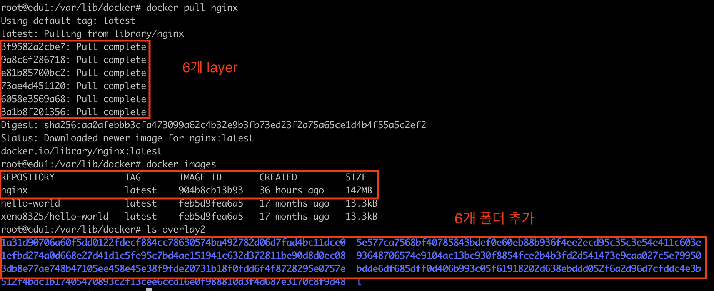
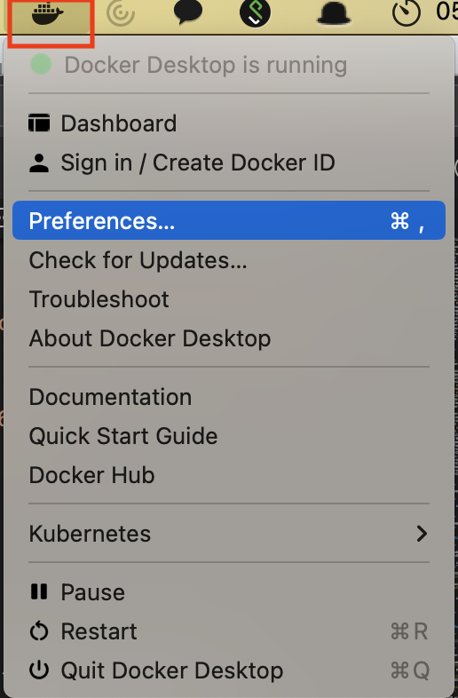
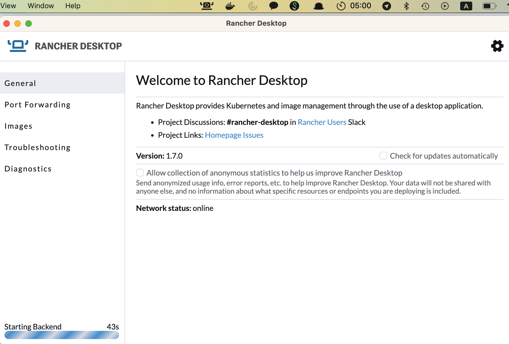

# Chapter 1 

Docker에  자세한 설명과 실습을 한다.   

1. Docker 소개

2. Docker 실습 ( Dockerfile 구성 및 빌드 , Tag , Push/Pull )

3. Jenkins를 사용한 CI 구성 하기

<br/>

## 1. Docker 소개

<br/>

> 도커 소개 
-  따베도 : https://youtu.be/NLUugLQ8unM
-  얄팍한 코딩사전 : https://youtu.be/tPjpcsgxgWc

<br/>


### VM vs Container

<br/>

가상화(Virtualization)는 물리적인 컴포넌트(Components, HW장치)를 논리적인 객체로 추상화 하는 것을 의미하는데, 마치 하나의 장치를 여러 개처럼 동작시키거나 반대로 여러 개의 장치를 묶어 마치 하나의 장치인 것처럼 사용자에게 공유자원으로 제공할 수 있어 클라우드 컴퓨팅 구현을 위한 핵심기술이다.    

가상화의 대상이 되는 컴퓨팅 자원은 프로세서(CPU), 메모리(Memory), 스토리지(Storage), 네트워크(Network)를 포함하며, 이들로 구성된 서버나 장치들을 가상화함으로써 높은 수준의 자원 사용율(물리서버 10~15% vs 가상화 70% 이상) vs 과 분산 처리 능력을 제공할 수 있다.    

<br/>

#### 가상머신

<br/>

가상화를 통하여 구현되는 복제된 컴퓨팅 환경.  
- 운용목적1. 하나의 하드웨어위에 동시에 여러 종류의 운영체제나 프로토콜을 실행
- 운용목적2. 하나의 하드웨어 자원을 여러 사용자에게 분할
- 운용목적3. 가상화를 통해 분할된 시스템 간 상호 간섭이 없는 독립성(Isolation)을 보장

<br/>

#### 하이퍼바이저

<br/>

공유 컴퓨팅 자원을 관리하고 가상머신들을 컨트롤(I/O  명령  처리) 하는 중간관리자.

<br/>

#### 컨테이너

<br/>

모듈화되고 격리된 컴퓨팅 공간 또는 컴퓨팅 환경을 의미하며, 시스템 환경 의존성을 탈피하고 안정적으로 구동.

<br/>

#### 가상머신과 컨테이너의 차이점

<br/>

- 컨테이너는 가상화에서 하이퍼바이저와 게스트OS 불필요  
- 대신, 컨테이너는 OS 레벨에서 프로세스를 격리하여‘모듈화된 프로그램 패키지’로써 수행함
따라서 컨테이너는 가상머신보다 가볍고(수십 MB) 빠름  
- 이는 더 많은 응용프로그램을 더 쉽게 하나의 물리적 서버에서 구동시키는 것을 가능케 함  

<br/>


 

<br/>

### Docker Overview

<br/>

소개 및 배경
- 도커는 컨테이너 기반의 오픈소스 가상화 플랫폼이다.
- 다양한 이유로 계속 바뀌는 서버 환경과 개발 환경 문제를 해결하기 위해 등장했다.
   (툴 업데이트, 회사의 툴 사용 변경, 회사의 언어 정책 변경 등 )  
- 기존에 서버와 개발 환경이 변경되면 컴퓨터 셋팅(개발 환경) 등을 다시하거나 
  그 과정에서 발생하는 문제들과 같이, 여러모로 불편한 점이 많았다.
- 도커가 등장하고 서버관리/개발 방식이(컨테이너) 완전히 편리하게 바뀌게 된다.

사용하는 이유
- 도커 허브에 올라온 이미지와 docker-compose.yml의 설정으로 원하는
  프로그램을 편안하게 설치가 가능하다.
- 컨테이너를 생성하여 분리된 환경에 설치하므로 제거도 쉽다.
- 하나의 서버(로컬 호스트)에 포트만 변경하여 동일한 프로그램을 실행하기도 쉽다.
- 도커를 사용하지 않으면 환경변수나 경로 등의 충돌로 피곤하기 그지 없다.

서버관리 방식의 변화
- 전통적인 서버관리 방식은 아래와 같이 각 단계별로 흐름이 있었고, 각 단계가
  업데이트 되거나 어떤 문제가 발생하면 전체 흐름이 중단되는 문제가 있었다.
- 도커 등장 이후 어떠한 프로그램도 컨테이너로 만들 수 있다.
- 서로 다른 프로그램이더라도 컨테이너로 규격화 되었음  
- AWS, Azure, Google cloud 등 어떤 환경에서도 돌아간다.  
    
- 가상머신과 비슷하게 생각할 수 있지만 비슷한점과 다른점이 있다.
- 가상머신처럼 독립적으로 실행되지만, 가상머신보다 빠르고 쉽고 효율적이다.
- 도커는 컴퓨터 자원을 그대로 사용한다. 

도커의 특징
- 도커는 가상머신이 아니고 격리만 해주기 떄문에 성능상 하락이 없다. (성능 하락이 큰 VM과 다르다.)
- 확장성과 이식성
    -  도커가 설치되어 있다면 어디서든 컨테이너를 실행할 수 있다.
    - 오픈 소스이기에 특정 회사나 서비스에 종속적이지 않다.
    - 쉽게 개발서버를 만들 수 있고 테스트 서버 생성도 가능하다.
- 표준성
    - 도커를 사용하지 않는 경우, 각각의 언어로 만든 서비스들의 배포 방식은 모두 다르다.
    - 도커는 컨테이너라는 표준으로 서버를 배포하므로 모든 서비스들의 배포 과정이 동일해진다.
- 이미지
    - 컨테이너를 실행하기 위한 압축파일과 같은 개념이다.
    - 이미지에서 컨테이너를 생성하기 떄문에 반드시 이미지를 만드는 과정이 필요하다.
    - Dockerfile을 이용하여 이미지를 만들고 처음부터 재현 가능하다.
    - 빌드 서버에서 이미지를 만들면 해당 이미지를 이미지 저장소(허브)에 저장하고 운영서버에서 이미지를 불러와 사용한다.
- 설정관리
    - 도커에서 설정은 보통 아래와 같이 환경변수로 제어한다.
    - MYSQL_PASS=password와 같이 컨테이너를 띄울 때 환경변수를 같이 지정한다.
    - 하나의 이미지가 환경변수에 따라 동적으로 설정파일을 생성하도록 만들어져야한다.
- 자원관리
    - 컨테이너는 삭제 후 새로 만들면 모든 데이터가 초기화된다. (제거가 쉽다.)
    - 그러므로 저장이 필요하다면, 업로드 파일을 외부 스토리지와 링크하여 사용하거나 S3같은 별도의 저장소가 필요하다.
    - 세션이나 캐시를 memcached나 redis와 같은 외부로 분리한다.

<br/>

### namespace , cgroup 등 

<br/>

> 참고 
- 출처 1 : https://tech.ssut.me/what-even-is-a-container/  
- 출처 2 : https://gngsn.tistory.com/128

<br/>

### Docker Registry 

<br/>

> 참고 
- 출처 1 : https://hoing.io/archives/24501

<br/>

Registry 란  

<br/>

Registry 는 Docker 이미지를 저장하고 배포하는 표준 방법입니다. 이 Registry는 개방형 Apache 라이선스에 따른 오픈 소스 기반 리포지토리입니다.  


Repository 와 같은 개념으로 public registry 중 대표적인 사이트가 Docker Hub 입니다.

<br/>

  

<br/>

Registry는 대부분 Public Cloud 에서 지원을 하고 있고 private으로 사용하는 경우 비용이 발생합니다.    

내가 만든 이미지를 사내에서만 사용하거나 특정 그룹 등에게만 배포를 하고자 할 수 있습니다.  

그럴때 Public 한 Registry 서비스가 아닌 내가 별도로 구성한 Private Registry 를 사용하고자 하는 필요성이 있을 것 입니다.  

이럴 경우 별도로 Registry 를 구성하여 다른 서버의 Docker 시스템에서 사용할 수 있습니다.  

오늘 실습중에 nexus를 사용하여 private docker registry를 구축 할수 있습니다.  
  

<br/>

위와 같이 설정 후 변경 부분을 flush 해주고 재시작을 해야 합니다.

```bash
root@newedu:~# systemctl daemon-reload
root@newedu:~# systemctl restart docker
```  

<br/>

### Docker 정보 보기

<br/>

- docker info : 도커가 설치된 host의 정보 ( 도커 설치 위치 ) , 로그인 정보 , Insecure Registry 정보를  볼수 있다.  
- docker version : 설치된 도커 정보를 자세히 볼수 있다.  

<br/>

docker info

```bash
root@newedu:~# docker info
Client:
 Context:    default
 Debug Mode: false
 Plugins:
  app: Docker App (Docker Inc., v0.9.1-beta3)
  buildx: Docker Buildx (Docker Inc., v0.8.2-docker)
  scan: Docker Scan (Docker Inc., v0.17.0)

Server:
 Containers: 53
  Running: 4
  Paused: 0
  Stopped: 49
 Images: 596
 Server Version: 20.10.17
 Storage Driver: overlay2
  Backing Filesystem: extfs
  Supports d_type: true
  Native Overlay Diff: true
  userxattr: false
 Logging Driver: json-file
 Cgroup Driver: cgroupfs
 Cgroup Version: 1
 Plugins:
  Volume: local
  Network: bridge host ipvlan macvlan null overlay
  Log: awslogs fluentd gcplogs gelf journald json-file local logentries splunk syslog
 Swarm: inactive
 Runtimes: io.containerd.runc.v2 io.containerd.runtime.v1.linux runc
 Default Runtime: runc
 Init Binary: docker-init
 containerd version: 10c12954828e7c7c9b6e0ea9b0c02b01407d3ae1
 runc version: v1.1.2-0-ga916309
 init version: de40ad0
 Security Options:
  apparmor
  seccomp
   Profile: default
 Kernel Version: 5.15.0-051500-generic
 Operating System: Ubuntu 18.04.6 LTS
 OSType: linux
 Architecture: x86_64
 CPUs: 8
 Total Memory: 15.62GiB
 Name: newedu
 ID: PMLT:R44W:222I:EERF:O5YE:XWDP:2U6W:W6RE:DCWC:QHOY:Z5WF:EA6W
 Docker Root Dir: /data/docker
 Debug Mode: false
 Username: shclub
 Registry: https://index.docker.io/v1/
 Labels:
 Experimental: false
 Insecure Registries:
  211.252.85.148:40010
  127.0.0.0/8
 Live Restore Enabled: false
```  

<br/>

Docker Root Directory는 기본 값이 /var/lib/docker 이지만 kt cloud VM 의 Storage가 너무 작아 추가로 disk attach 한 후 폴더 변경 했음.  

<br/>

/var/lib/docker 폴더로 이동 하면 overlay2 폴더가 보이고 docker images가 여기에 layer 별로 저장이 된다.  

<br/>

```bash
root@edu1:/var/lib/docker# ls
buildkit  containers  image  network  overlay2  plugins  runtimes  swarm  tmp  trust  volumes
root@edu1:/var/lib/docker# docker images
REPOSITORY             TAG       IMAGE ID       CREATED         SIZE
hello-world            latest    feb5d9fea6a5   17 months ago   13.3kB
xeno8325/hello-world   latest    feb5d9fea6a5   17 months ago   13.3kB
root@edu1:/var/lib/docker# ls overlay2
5e577ca7568bf40785843bdef0e60eb88b936f4ee2ecd95c35c3e54e411c603e  l
```  

<br/>

도커 이미지를 신규로 pull 하면 6개의 layer를 볼수 있고 layer 별로 폴더가 생성이 됩니다.

<br/>

  


<br/>

docker version  

```bash
root@newedu:~# docker version
Client: Docker Engine - Community
 Version:           20.10.17
 API version:       1.41
 Go version:        go1.17.11
 Git commit:        100c701
 Built:             Mon Jun  6 23:02:56 2022
 OS/Arch:           linux/amd64
 Context:           default
 Experimental:      true

Server: Docker Engine - Community
 Engine:
  Version:          20.10.17
  API version:      1.41 (minimum version 1.12)
  Go version:       go1.17.11
  Git commit:       a89b842
  Built:            Mon Jun  6 23:01:02 2022
  OS/Arch:          linux/amd64
  Experimental:     false
 containerd:
  Version:          1.6.6
  GitCommit:        10c12954828e7c7c9b6e0ea9b0c02b01407d3ae1
 runc:
  Version:          1.1.2
  GitCommit:        v1.1.2-0-ga916309
 docker-init:
  Version:          0.19.0
  GitCommit:        de40ad0
```  

<br/>  

윈도우와 맥 사용자는 Docker Desktop 을 설치 해서 사용 할 수 있고,  

<br/>

 

<br/>

최근에는 Rancher Desktop ( k3s ) 도 사용 가능 합니다.    


   

<br/>

위에 솔루션들은 로컬에서 kubernetes 도 실행이 가능하며 메모리는 16기가 권장합니다.  


<br/>

### Docker 명령어 알아보기

<br/>

> 참고
- 출처 : https://bigpel66.oopy.io/library/docker 

<br/>

#### Docker image

<br/>

Image는 Container를 생성할 때 필요한 요소이며, 이는 VM으로 치면 iso 파일과 비슷하다고 생각하면 된다.   

Image는 여러 Layer로 이루어져 Container들이 동일한 Layer를 이용하려 할 때 재사용이 가능한 구조를 갖고 있다. Image를 이루고 있는 Layer는 바이너리 파일로써 유지되며, 오로지 Read-Only이다.  

Image는 <hub-id> / <image-name> : <tag>의 형식을 가진다.   
예를 들어 shclub 이라는 사용자가 14.04 버전의 ubuntu라는 이미지를 사용한다면,  shclub/ubuntu:14.04와 같이 표기한다.   


이 때 <hub-id>와 <tag>에 대해서는 생략이 가능하며, <hub-id> 생략 시에는 Docker Hub에서 Offical한 Image를 의미하게 되고 <tag>를 생략하게 되면 latest 버전을 지칭하게 된다. 단, <image-name>은 생략할 수 없다.  

<br/>

#### Docker Container  

<br/>

Docker Image를 이용하여 Container를 생성할 수 있다.  

Container를 생성하면, 현재 사용하고 있는 머신과는 독립적인 공간에 Image의 목적에 맞는 파일 시스템과 가상화된 시스템 자원 및 가상화된 네트워크를 이용할 수 있게 된다. 생성된 공간에서는 Image의 목적만을 수행하는 것이 일반적이다.  

Container는 Image를 Read-Only로 이용하기만 하고, Image의 내용을 수정하거나 Image 내용 외에 추가적으로 수행된 부분에 대해서는 Container에 해당하는 Layer에 그 내용을 기록하게 된다.   

따라서 Image는 Container가 동작하더라도 끝까지 Read-Only를 유지할 수 있게 된다. 즉, Container에서 특정 Layer에 변동 사항이 생기더라도 이를 Image에 바로 기록하는 것이 아니기 때문에, 해당 Layer를 참조하고 있는 여러 Container들은 변동 사항이 적용되지 않은 깨끗한 상태로 Layer를 사용할 수 있게 된다.  

Container는 독립적인 공간을 제공 받아서 구동되기 때문에, Container에서 어떤 작업을 하더라도 머신에는 영향을 끼치지 않으며 심지어 Container 간에도 그 어떤 영향을 끼치지 않는다.  

<br/>


#### Image Commands 

<br/>

Image 명령어들에 대해서 <image-name> 뒤에는 <tag>를 붙일 수 있는데, 이를 생략하면 자동으로 latest 버전으로 명령어를 수행한다.  

- Image 찾기
  Docker Hub에서 Public으로 배포되어 있는 Image를 검색할 수 있다.  

<br/>

```bash
root@newedu:~# docker search nginx
NAME                                              DESCRIPTION                                     STARS     OFFICIAL   AUTOMATED
nginx                                             Official build of Nginx.                        18169     [OK]
linuxserver/nginx                                 An Nginx container, brought to you by LinuxS…   187
bitnami/nginx                                     Bitnami nginx Docker Image                      151                  [OK]
ubuntu/nginx                                      Nginx, a high-performance reverse proxy & we…   79
privatebin/nginx-fpm-alpine                       PrivateBin running on an Nginx, php-fpm & Al…   72                   [OK]
bitnami/nginx-ingress-controller                  Bitnami Docker Image for NGINX Ingress Contr…   23                   [OK]
rancher/nginx-ingress-controller                                                                  11
ibmcom/nginx-ingress-controller                   Docker Image for IBM Cloud Private-CE (Commu…   4
kasmweb/nginx                                     An Nginx image based off nginx:alpine and in…   4
bitnami/nginx-exporter                                                                            3
bitnami/nginx-ldap-auth-daemon                                                                    3
circleci/nginx                                    This image is for internal use                  2
rapidfort/nginx                                   RapidFort optimized, hardened image for NGINX   2
vmware/nginx                                                                                      2
rancher/nginx                                                                                     2
rancher/nginx-ingress-controller-defaultbackend                                                   2
bitnami/nginx-intel                                                                               1
rapidfort/nginx-official                          RapidFort optimized, hardened image for NGIN…   1
vmware/nginx-photon                                                                               1
rancher/nginx-conf                                                                                0
ibmcom/nginx-ppc64le                              Docker image for nginx-ppc64le                  0
ibmcom/nginx-ingress-controller-ppc64le           Docker Image for IBM Cloud Private-CE (Commu…   0
rancher/nginx-ssl                                                                                 0
rapidfort/nginx-ib                                RapidFort optimized, hardened image for NGIN…   0
continuumio/nginx-ingress-ws                                                                      0
```

<br/>

- Image 다운로드
  Docker Hub에서 <image-name>에 해당하는 Image를 로컬에 다운로드 한다.  

<br/>

```bash
root@newedu:~# docker pull nginx
Using default tag: latest
latest: Pulling from library/nginx
3f9582a2cbe7: Pull complete
9a8c6f286718: Pull complete
e81b85700bc2: Pull complete
73ae4d451120: Pull complete
6058e3569a68: Pull complete
3a1b8f201356: Pull complete
Digest: sha256:aa0afebbb3cfa473099a62c4b32e9b3fb73ed23f2a75a65ce1d4b4f55a5c2ef2
Status: Downloaded newer image for nginx:latest
docker.io/library/nginx:latest
```

<br/>

- Image 목록확인
  현재 로컬에 유지 중인 Image들의 목록을 확인할 수 있다.  

<br/>

```bash
root@newedu:~# docker images
REPOSITORY                                                         TAG                     IMAGE ID       CREATED         SIZE
nginx                                                              latest                  904b8cb13b93   32 hours ago    142MB
kasmdemo                                                           latest                  f65eacdbeffc   8 days ago      3.04GB
ghcr.io/shclub/batch-minji                                         master                  893d467601c4   6 weeks ago     703MB
kasmweb/core-ubuntu-focal                                          develop                 7cf56c4f567b   7 weeks ago     2.23GB
busybox                                                            latest                  66ba00ad3de8   8 weeks ago     4.87MB
```

<br/>

- Image 삭제
  현재 Container들에 의해 참조되고 있지 않은 Image를 삭제할 수 있다.  

<br/>

```bash
root@newedu:~# docker rmi nginx:latest
Untagged: nginx:latest
Untagged: nginx@sha256:aa0afebbb3cfa473099a62c4b32e9b3fb73ed23f2a75a65ce1d4b4f55a5c2ef2
Deleted: sha256:904b8cb13b932e23230836850610fa45dce9eb0650d5618c2b1487c2a4f577b8
Deleted: sha256:2c19cc81bd7d9245f864a8dad55fc439a503efbc9a6f971307099c426371e5df
Deleted: sha256:a244752d2cc30ced3987603eb318fdf7ddd1f16a9c04de65fe44bd849ac79b1a
Deleted: sha256:09d2e7b44137eaaff2c092a9e956f63074c8d4fd72870e35a064d8dabc3c3351
Deleted: sha256:a6ecfbc1b8be1e553e7b9a5ca036e449a51c46cb22ae3193e67a72d4273aa8ca
Deleted: sha256:26b53bdf904af4f66504b2cdbc6dbf2f8aa4fdc74284b4de2389ae96c1b3ea05
Deleted: sha256:650abce4b096b06ac8bec2046d821d66d801af34f1f1d4c5e272ad030c7873db
```  

<br/>

Image는 Layer 구조로 그 형태를 유지하고 있으며, 이 덕분에 여러 Container가 특정 Layer를 이용해야 한다면 해당 Layer를 여럿 두지 않고도 재사용함으로써 Container를 생성할 수 있다.  

위의 그림에서 출력된 각 줄은 Image를 구성하는 Layer들을 의미하고, Image  삭제는 Layer 단위로 이뤄지는 것을 확인할 수 있다. 이 때 삭제 결과는 Untagged와 Deleted로 나뉜다.   

Untagged는 삭제하려는 Layer가 여전히 다른 Image에 의해 참조되고 있는 Layer이기 때문에 Layer 상에서 현재 Image의 이름만 지움으로써 참조만 없앤 것이다. 반면 Deleted는 삭제하려는 Layer가 다른 Image에 의해 참조되고 있지 않는 Layer이기 때문에 Layer 상의 현재 Image 이름을 지우면서 어떠한 참조도 일어나지 않아 완전히 삭제된 것을 의미한다.   

위의 삭제 흐름을 자세히 살펴보면, Image 이름에 대한 Untagged가 먼저 일어나면서 이름을 먼저 삭제한 후, Image를 이루는 Layer들을 하나씩 삭제하는 것을 확인할 수 있다.

<br/>

- Image 강제 삭제
  옵션 없이 rmi 를 이용하면 Image의 Layer 중 하나라도 참조 중인 Container가 존재하면 Image를 삭제할 수 없었다. 하지만 Unix 명령어 rm과 마찬가지로 -f 옵션으로 삭제를 강제할 수 있다.  

<br/>

- Dangling Image 목록 확인
  Container 가 실행중인 image는 Container들을 모두 정리 후에 Image를 삭제해야 깔끔하게 삭제되는데 
  Dangling Image는 이름이 존재하지 않는 Image므로 위 그림과 같이 <none>이라는 이름으로 나타난다.    

<br/>

```bash
root@newedu:~# docker images -f dangling=true
REPOSITORY               TAG       IMAGE ID       CREATED        SIZE
shclub/edu12-4           <none>    ce8084788ee1   3 months ago   727MB
shclub/edu12-3           <none>    f7b4e20be2d4   3 months ago   25.1MB
shclub/edu1              <none>    e9ee9e268c2f   4 months ago   136MB
<none>                   <none>    bea2addec262   4 months ago   136MB
<none>                   <none>    7d1c1d6d4c0a   4 months ago   136MB
<none>                   <none>    fc02c56739dc   4 months ago   136MB
<none>                   <none>    d3993004d424   4 months ago   136MB
<none>                   <none>    fe251f2d55f6   4 months ago   136MB
<none>                   <none>    39e05c88e27f   4 months ago   136MB
<none>                   <none>    aa7342a932fa   4 months ago   136MB
<none>                   <none>    7bf2d893f619   4 months ago   136MB
<none>                   <none>    208cff6e1c01   4 months ago   136MB
```
<br/>

- Dangling Image 삭제   
  현재 로컬에 존재하는 모든 Dangling Image들을 삭제한다. 단, Dangling Image를 모두 지우려고 할 때 현재 Dangling Image의 Layer를 참조하고 있는 Container가 하나라도 존재한다면, prune 명령어를 사용해도 Layer들은 삭제되지 않는다

<br/>

```bash
root@newedu:~# docker image prune
WARNING! This will remove all dangling images.
Are you sure you want to continue? [y/N] y
Deleted Images:
deleted: sha256:57e81d3fd9632b3439d45ac914ca8e5b2ec75eba07b6187111260810329aa3d5
deleted: sha256:3f772f27f535a3891d8b8692904d4a2df1bd07b726255ecf91f56b11e96edffd
deleted: sha256:8a5930b15fda06670441fc8a63e693940418d27066fe8bc482e5d265bfc9454d
deleted: sha256:d2881c06a46bb6d068bf0b1b0fdc86050c872087ad414fe39d5a4404e314df4e
deleted: sha256:99fdd74e518253e8631e9cd604ca4294f5f9cf8a36a46e37dd9b2c81a5b1d05e
deleted: sha256:becf0e5081a7199a511597ea8d3960c1d28b40708e612a6b1351c777add945c1
deleted: sha256:cb2a25d1079d1e2356507d2419b8bf61d3a80e310b3d4adbb1eaa40e09fe080f
deleted: sha256:774c9b2e22135a1eadaef6dea1d1fa630521fc88f040e8492770dcb2dc3c4363
deleted: sha256:aded7421bf0f0fb850475655563aebac5b54cf7be707eb86255cb09e09d8159c
deleted: sha256:ff154e3e3256c1a29c05ac6360a5ed9c078770231bf3501e86581702eef34cbc
deleted: sha256:f1e7be9887a819e680cf745cee4d64ca12e2f8fc4360d069ecdbd3b37fac21bd
deleted: sha256:9fa8d90471442956162e853347acdabd1e2806893c5d67e692771e8bd624b826
deleted: sha256:c0001de599cd35cfe2fbddd18da8e2192c21542ebb6009ebd41719a14c62571c
deleted: sha256:59b5af715f55c8b1f6f1d2eea80ea230d9837c66aff4e0971370bc9866a7a3b7
deleted: sha256:6c709da787f9ec0d1b9bd2ea489b583821ac1b18b25ce7b35620984b7728c8ea

Total reclaimed space: 1.169GB
```

<br/>

- Image 정보 확인   
  Image는 단순히 어떤 Layer들로 이뤄졌는지 뿐만 아니라 정말 많은 정보들을 갖고 있다. inspect를 통해 이 정보들을 확인할 수 있다

<br/>

```bash
root@newedu:~# docker inspect nginx:1.14-alpine
[
    {
        "Id": "sha256:8a2fb25a19f5dc1528b7a3fabe8b3145ff57fe10e4f1edac6c718a3cf4aa4b73",
        "RepoTags": [
            "nginx:1.14-alpine",
            "nginx:1.14.2-alpine",
            "ghcr.io/shclub/nginx:1.14-alpine",
            "ghcr.io/shclub/nginx:1.14.2-alpine"
        ],
        "RepoDigests": [
            "nginx@sha256:485b610fefec7ff6c463ced9623314a04ed67e3945b9c08d7e53a47f6d108dc7",
            "ghcr.io/shclub/nginx@sha256:a3a0c4126587884f8d3090efca87f5af075d7e7ac8308cffc09a5a082d5f4760"
        ],
        "Parent": "",
        "Comment": "",
        "Created": "2019-04-10T01:08:46.210666872Z",
        "Container": "0a597833eefb7f60fd434dcc4438c1bd0d514a42f5925513841ec5c3295d62d4",
        "ContainerConfig": {
            "Hostname": "0a597833eefb",
            "Domainname": "",
            "User": "",
            "AttachStdin": false,
            "AttachStdout": false,
            "AttachStderr": false,
            "ExposedPorts": {
                "80/tcp": {}
            },
            "Tty": false,
            "OpenStdin": false,
            "StdinOnce": false,
            "Env": [
                "PATH=/usr/local/sbin:/usr/local/bin:/usr/sbin:/usr/bin:/sbin:/bin",
                "NGINX_VERSION=1.14.2"
            ],
            "Cmd": [
                "/bin/sh",
                "-c",
                "#(nop) ",
                "CMD [\"nginx\" \"-g\" \"daemon off;\"]"
            ],
            "ArgsEscaped": true,
            "Image": "sha256:aff1bb24fb4907c200a9e7cbabe65ec4b5490bc511ab7f1f69b2946f709a27cb",
            "Volumes": null,
            "WorkingDir": "",
            "Entrypoint": null,
            "OnBuild": null,
            "Labels": {
                "maintainer": "NGINX Docker Maintainers <docker-maint@nginx.com>"
            },
            "StopSignal": "SIGTERM"
        },
        "DockerVersion": "18.06.1-ce",
        "Author": "",
        "Config": {
            "Hostname": "",
            "Domainname": "",
            "User": "",
            "AttachStdin": false,
            "AttachStdout": false,
            "AttachStderr": false,
            "ExposedPorts": {
                "80/tcp": {}
            },
            "Tty": false,
            "OpenStdin": false,
            "StdinOnce": false,
            "Env": [
                "PATH=/usr/local/sbin:/usr/local/bin:/usr/sbin:/usr/bin:/sbin:/bin",
                "NGINX_VERSION=1.14.2"
            ],
            "Cmd": [
                "nginx",
                "-g",
                "daemon off;"
            ],
            "ArgsEscaped": true,
            "Image": "sha256:aff1bb24fb4907c200a9e7cbabe65ec4b5490bc511ab7f1f69b2946f709a27cb",
            "Volumes": null,
            "WorkingDir": "",
            "Entrypoint": null,
            "OnBuild": null,
            "Labels": {
                "maintainer": "NGINX Docker Maintainers <docker-maint@nginx.com>"
            },
            "StopSignal": "SIGTERM"
        },
        "Architecture": "amd64",
        "Os": "linux",
        "Size": 16032814,
        "VirtualSize": 16032814,
        "GraphDriver": {
            "Data": {
                "LowerDir": "/data/docker/overlay2/b02427f1e801d0ae7e6f1606ee39a3e7c90404773d6edf624b9ba0443e225e55/diff:/data/docker/overlay2/5209c0e0eab17e5da914f2a6693d2b72ee099b391055412c11eba9550bf67f22/diff:/data/docker/overlay2/d833cc7e427fc521496824415a94b810b8d66e4b3e4ab560e32b6fd2e1cd42bc/diff",
                "MergedDir": "/data/docker/overlay2/ae40a0e980e75bda41cb8540a9c96dbd4c8c14ff601d03b09912d763b727f814/merged",
                "UpperDir": "/data/docker/overlay2/ae40a0e980e75bda41cb8540a9c96dbd4c8c14ff601d03b09912d763b727f814/diff",
                "WorkDir": "/data/docker/overlay2/ae40a0e980e75bda41cb8540a9c96dbd4c8c14ff601d03b09912d763b727f814/work"
            },
            "Name": "overlay2"
        },
        "RootFS": {
            "Type": "layers",
            "Layers": [
                "sha256:a464c54f93a9e88fc1d33df1e0e39cca427d60145a360962e8f19a1dbf900da9",
                "sha256:5ac9a5170bf254da6d1b54edbfde4da4070e5c43a85a0402ec7defdcec5c3657",
                "sha256:b2cbae4b8c158c49c6590cc69a305c36dfb133321c3ab1e9c3b764f54c27158a",
                "sha256:076c58d2644f0d4c4a80d460bc2dfb21469f4fdb5c3d259438e0a4a1b182fa87"
            ]
        },
        "Metadata": {
            "LastTagTime": "2022-10-25T08:38:05.74031602+09:00"
        }
    }
]
```
<br/>

- Image 이름 추가    
  명령어를 수행하면 동일한 Image의 Digest를 유지하지만, 각기 다른  <image-name>이 부여되는 것을 확인할 수 있다. 즉, Image에 추가적으로 이름을 부여하는 것과 동일한데 이는 Docker Hub에 Image를 업로드할 때 주로 이용 된다. 현재 로컬에서 사용하고 있는 Docker Hub의 ID으로 <hub-id>를 설정함으로써 문제 없이 Image를 업로드 할 수 있다.

<br/>

```bash
root@newedu:~# docker tag busybox:1.28 shclub/busybox:1.28
```  

<br/>

- Image Upload  
  <image-name>에 해당하는 Image를 Docker Hub에 업로드 한다. Docker Hub의 어떤 계정에 업로드 하는지는 <hub-id>를 통해 결정하므로 <hub-id>는 Docker Hub의 ID와 동일해야 하며, 로컬에서도 로그인이 되어 있어야 한다. 문제 없이 push가 된다면, <image-name>이 곧 Repository의 이름이 된다.  

<br/>

```bash
root@newedu:~# docker push shclub/busybox:1.28
The push refers to repository [docker.io/shclub/busybox]
432b65032b94: Mounted from library/busybox
1.28: digest: sha256:74f634b1bc1bd74535d5209589734efbd44a25f4e2dc96d78784576a3eb5b335 size: 527
```  

<br/>

- Image 내보내기    
  Image를 별도로 저장하거나 옮길 때 바이너리 파일로써 이용해야 할 수도 있다. save 명령어를 이용하면 Container를 생성할 때 사용했던 명령어, Image의 이름 및 태그, 그리고 Image의 모든 메타 데이터를 포함하여 내보내는 것이 가능하다.  
  -o 옵션을 이용하면 표준 출력으로 결과를 내보내지 않고 <file-name>의 이름으로 된 파일로 저장하겠다는 것이다. save를 수행하게 되면 tar로 아카이빙 된 파일을 만들며, 해당 명령어는 load 명령어와 쌍으로 이용된다.  

<br/>

```bash
root@newedu:~# docker save -o busybox:1.28.tar busybox:1.28
root@newedu:~# ls  busybox:*
busybox:1.28.tar
```  

<br/>

- Image 가져오기    
  바이너리 파일로 유지 중인 Image를 가져올 때 사용된다. load 명령어를 이용하면 Container를 생성할 때 사용했던 명령어, Image의 이름 및 태그, 그리고 Image의 모든 메타 데이터를 포함하여 가져오는 것이 가능하다.   
  -i 옵션은 표준 입력을 이용하지 않고 문자열 인자로 <file-name>을 받겠다는 것이다. save 명령어와 쌍으로 이용되므로 load에 사용되는 파일은 tar로 아카이빙된 파일이어야 한다.  

<br/>

```bash
root@newedu:~# docker load -i busybox:1.28.tar
Loaded image: busybox:1.28
```  
<br/>

docker save/load 는 주로 페쇄망에서 Docker 이미지 빌드가 어려운 경우 
오픈망에서 빌드 이후에  폐쇄망에서 작업시 많이 사용

<br/>

## 2. Docker 실습

<br/>

### Dockerfile 이란 ?

<br/>

자신만의 도커 이미지를 만들기 위해서는 Dockerfile을 만들어야 한다.    

- docker에서 이용하는 이미지를 기반으로 하여 새로운 이미지를 스크립트 파일을 통해 내가 설정한 나만의 이미지를 생성할 수 있는 일종의 이미지 설정파일입니다.  


- dockerfile을 이용하면 컨테이너 생성 시 기존 이미지로 생성하였을 경우 추가로 설정해줘야 할 것들을 미리 설정 및 사전 준비가 가능하므로 잘 이용할 수 있다면 무궁무진한 형태의 이미지를 좀 더 간편하고 손쉽게 만들어 낼 수 있습니다.  

- dockerfile의 경우 파일이 있는 디렉토리를 context로 인식하여 작업이 진행되므로 작성 및 빌드까지 새로운 디렉토리를 만들어서 해당 디렉토리 내부에서 작업을 진행하시는 것을 추천합니다.

- Dockerfile 자체에 다른 확장자가 있는 것은 아니므로 원하시는 파일 이름으로 생성을 진행

<br/>

### Git Clone 하여 github 소스 가져오기.  

<br/>

github 에서  shclub/edu1 를 선택하고 code를 클릭한다.  
https의 url를 복사한다. 오른쪽 복사 아이콘 클릭  

  

<br/>

터미털에서 git clone 명령어를 사용하여 로컬에 소스를 가져온다.    

정상적으로 가져오면 edu1 폴더로 이동하여 파일 받아진것 확인한다.

```bash
root@newedu:/# git clone https://github.com/shclub/edu1.git
Cloning into 'edu1'...
remote: Enumerating objects: 308, done.
remote: Counting objects: 100% (186/186), done.
remote: Compressing objects: 100% (151/151), done.
remote: Total 308 (delta 117), reused 9 (delta 9), pack-reused 122
Receiving objects: 100% (308/308), 62.67 KiB | 406.00 KiB/s, done.
Resolving deltas: 100% (151/151), done.
root@newedu:/# ls edu1
Dockerfile  Jenkinsfile  Jenkinsfile_old  README.md  app.py  buildspec.yml  requirements.txt  test.sql
```

<br/>


### Dockerfile  

<br/>

위에서 복사한 Dockerfile은 아래와 같다.

<br/>

Dockerfile 예제

```yaml
# 베이스 이미지 이며 이미지 이름 앞에 아무것도 없으면 docker hub에서 가져온다.
FROM python:3.8-slim

# 컨테이너 안에 작업 폴더를 설정한다.
WORKDIR /app

# 로컬 현대 폴더의 모든 값을 컨테이너 /app 폴더에 복사한다.
ADD . /app

RUN pip install -r requirements.txt

# 기본 이미지는 대부분 GMT+0 기준으로 생성되어 한국 시간으로 변경 해준다
RUN ln -snf /usr/share/zoneinfo/Asia/Seoul /etc/localtime && echo Asia/Seoul > /etc/timezone

# 컨테이너 외부에서 접속할 포트를 적어준다.
EXPOSE 40003

# 컨테이너 로딩시에 사용하는 명령어를 기입한다. 
# EntryPoint와 비슷 하나 CMD를 사용하면 docker run시에 파라미터 설정 가능하다.
CMD ["python", "app.py"]
```

<br/><br/>

명령어별 용도로 위의 내용을 정리해보겠습니다. 아래 서술하는 명령에는 위 예시에는 없는 것도 있습니다.

<br/>

- FROM  
docker 이미지 생성에 있어서 기초가 되는 이미지를 지정합니다.   

Dockerfile 작성에 있어서 가장 기초가 되는 부분이며 이미지를 로컬에 가지고 있을 경우 그냥 사용하지만, 없다면 도커 허브에서 제공하는 이미지를 불러오게 되어 있습니다.   

가장 기본 이미지는 Apline linux 입니다.

- MAINTAINER
해당 이미지의 생성, 유지, 보수, 등의 즉 관리자를 뜻하는 란입니다.
실질적으로는 아무런 효과는 없습니다.  

- RUN  
쉘 명령어를 사용 할 수 있도록 해줍니다. 위에 예시에서는 다중의 run 구문을 이용하여 가독성을 높였으나, &나 |, \ 등을 통해 줄여주실 수 있다면, 줄여주시는 것이 좋습니다.   
주로 packgage 설치나 기본 설정에 사용합니다.
 
- VOLUME  
이 이미지로 만든 컨테이너와 호스트 간의 연결이 가능한 볼륨을 지정해줍니다.   

이는 이미지 생성 후 docker run 명령어 사용 시 -v 옵션과 함께 <호스트 볼륨>:<컨테이너 볼륨>의 모양으로 설정하게 되며, 설정이 없을 경우, 이미지에서 제공하는 파일들이 들어가있게 됩니다.  
 

- EXPOSE  
컨테이너와 호스트 간 연결이 가능한 포트를 지정해주게 됩니다.  

- ADD 와 COPY  
ADD와 COPY는 이미지로 파일을 불러오는 기능을 합니다.  

차이점이라면 COPY의 경우 실제 로컬에서만 파일을 불러 올 수 있으며, 파일 자체를 가져오게 됩니다. ADD의 경우 url을 사용하여 외부에서도 파일을 가져 올 수 있으며, tar로 압축 된 파일을 풀어서 가져오게 됩니다. 다만 인터넷 url을 통해 가져온 파일의 경우는 tar의 경우에도 원본으로 가져옵니다.  

- ENTRYPONT와 CMD  
docker run 명령어 실행, 멈춰있던 컨테이너가 다시 시작될 경우 등에 쉘 명령어 및 스크립트를 변수를 받아 사용할 수 있습니다.  

이 두 명령어의 경우 용도 및 사용법이 매우 비슷하여 언뜻 구분이 어려울 수 있습니다.  

우선 위 예시를 보겠습니다.

<br/>

```yaml
ENTRYPOINT ["/usr/sbin/apachectl", "-D", "FOREGROUND"]  
```  

<br/>

/usr/sbin/apachectl 이라는 쉘 스크립트를 -D, FOREGROUND라고 하는 인자 값들을 받아 실행시키겠다는 의미입니다.

<br/> 

```yaml
ENTRYPOINT apachectl -D FOREGOUND  
```  

<br/>

이렇게 입력을 해줘도 되지만 위와 같이 입력을 해주는 것이 좀 더 정확하게 인식을 한다고 합니다.

왜냐하면 이렇게 입력하는 것은 기본을 /bin/sh -c 명령어로 호출하여 실행하기 때문입니다.  

<br/>

작성 방식은 RUN, ENTRYPOINT, CMD가 동일합니다.  

다만 RUN 명령어는 위에서 언급했듯 기초 세팅에 필요한 부분에서 이용하는 것이 좋습니다.  

ENTRYPOINT의 경우 dockerfile 내에서 단 1개만 작동합니다.  

<br/>

CMD의 경우 여러개를 선언하여도 override가 가능합니다. 

ENTRYPOINT와 CMD가 같이 쓰이기도 하는데,  


```yaml
ENTRYPOINT [“/bin/echo”,”Hello”]  
CMD [“world”]
```  

<br/>

라고 작성할 경우 결과물로 컨테이너 실행 시 Hello world를 볼 수 있습니다. 

<br/><br/>


### Docker image build 하기  

<br/>

clone으로 소스를 받았으면 별도 수정없이 Docker 이미지 생성 단계로 넘어 갑니다.  

  

<br/>

vi 에디터는 i (소문자) 를 누른 후  내용을 복사하여 붙여넣기 한다. 
esc 키를 누른 후 :wq를 입력하여 저장하고 나온다.   


app.py 화일의 내용은 아래와 같도 Flask 프레임 웍을 사용하며 내부 포트는 8080 이다.  

app.py    
```python
from flask import Flask
app = Flask(__name__)

@app.route("/")
def hello():
    return "Hello World!"

if __name__ == '__main__':
    app.run(host= '0.0.0.0',port=8080,debug=True)
```


<br/>

먼저  아래 명령어를 사용하여 기존의 컨테이너를 종료하고 삭제한다.  

```bash
docker rm -f $(docker ps -aq)
```  

<br/>

이제 아래 명령어를 사용하여 도커 이미지를 생성한다. 
Dockerfile 위치와 같은 폴더에서 실행하여야 하며 생성할 이미지 이름 뒤에 . 을 반드시 사용한다.  


```bash
docker build -t edu1 .
```   


Dockerfile의 line by line 으로 단계가 구성되어 도커 레이어를 생성을 한다.
내부 적으로는 docker commit 명령어가 실행이 되면 도커를 재 생성시에는 
Cache를 사용 하기 때문에 훨씬 빨리 빌드가 된다.

  

중간에 임시에 생성된 intermediate 컨테이너가 삭제가 되고 빌드 이미지가 만들어진다.  

아래 명령어를 사용하여 생성된 도커 이미지를 확인 할 수 있다.


```bash
docker images
```  


<br/>

### Docker image push 하기  

<br/>

로컬에서 생성된 이미지를 공유하기 위해서는 Docker Hub 에 저장을 해야 하고 그 전에  Docker Hub에서 계정을 생성한다. ( private repository 는 2개만 가능 )   

<br/>

이미 docker hub 계정이 있으면 아래와 같이 로그인을 한다.   
계정이 없으면 install.md 화일을 참고하여 생성한다.  

```bash
root@newedu:/# docker login
Login with your Docker ID to push and pull images from Docker Hub. If you don't have a Docker ID, head over to https://hub.docker.com to create one.
Username: shclub
Password:
WARNING! Your password will be stored unencrypted in /root/.docker/config.json.
Configure a credential helper to remove this warning. See
https://docs.docker.com/engine/reference/commandline/login/#credentials-store

Login Succeeded
```

<br/>

Docker Hub 로그인 후에 tagging 을 하고 push 를 한다.  
tag 명령어 뒤에는 로컬 이미지 이름 , 다음에는 도커허브 이미지 이름을 입력.

```bash
docker tag edu1 (본인 도커 허브 ID)/edu1
docker push (본인 도커 허브 ID)/edu1
```  


<br/>

Docker Hub에 페이지에서 push된 이미지를 확인한다.

  

<br/>

실행 중인 컨테이너를 확인하고 40003  포트를 사용하는 컨테이너를 stop 한다.  

```bash
docker ps
docker stop (컨테이너id)
```  


<br/>  

도커 이미지를 실행한다.
- -d : Detached 모드(백그라운드)
- --name : 컨테이너에 이름을 부여한다.
- -p : 포트 ( 외부접속포트 : 컨테이너 포트)
- 맨 마지막에 도커 이미지 이름  

```bash
docker run -d --name my-python -p 40003:5000 (본인 도커 허브 ID)/edu1
```  

<br/>

docker ps 명령어로 정상적인지 확인한다.


<br/>

docker ps 로 아무 것도 없으면 docker ps -a 명령어도 kill 된 컨테이너를 확인하고 docker logs 명령어로 로그를 확인한다.  

<br/>

```bash
docker logs (컨테이너id)
```  

  

<br/>

에러가 발생한 도커는 같은 이름으로 docker run 명령어를 실행 하면 에러가 발생하기 때문에 아래 명령어를 실행 후에 위의 docker run 명령어를 다시 실행한다.  

```bash
docker rm (컨테이너 이름)
```

<br/>

docker 컨테이너 안으로 들어가 본다.

```bash
docker exec -it (컨테이너id)   /bin/sh
```  

<br/>

컨테이너 내부에서 ls 명령어를 쳐보면 도커 빌드시 복사되었던 소스를 확인 할 수 있다.

  

exit 명령어를 사용하여 컨테이너 내부에서 나올수 있다.  

<br/>

컨테이너는 read-only 이지만 컨테이너에서 작업을 수행후에  
현재 컨테이너의 내용을 도커 이미지로 저장하고 싶을때는 commit 명령어를 사용한다.
- -m : 뒤에 comment를 적어준다
- 컨테이너 이름 : 현재 실행되는 컨테이너 이름 또는 컨테이너 아이디를 적여준다
- 신규 도커 이미지 : 신규로 생성하고 싶은 로컬 도커이미지 이름을 적어준다  

<br/>


```bash
docker commit -m "new edu1" (컨테이너 이름) (생성하고싶은 이미지 이름):(버전)
```  

  

<br/>

Docker image를 생성 하는 방법은 Dockefile을 사용한 방법과 commit을 통한 방법이 있으나 commit 으로 생성한 이미지는 history를 반드시 남겨서 해당 이미지의 내용을 확인 할 수 있어야 한다.  

<br/>

docker stats 명령어를 사용하면 컨테이너별로 CPU/MEM을 볼 수 있다.  

```bash
root@jakelee:~# docker stats
```  


<br/>

도커 추가 명령어  
- 정지 중인 컨테이너 삭제 : docker container prune
- 이미지 , 정지되어 있는 컨테이너 , 네트웍크 삭제 : docker system prune
- 도커 이미지 삭제 : docker rmi (도커 로컬 이미지 이름)
- 컨테이너 삭제 : docker rm [CONTAINER_ID] 
- 컨테이너 일시정지 :  docker stop [CONTAINER_ID]
- 컨테이너 일괄 삭제 : docker rm -f $(docker ps -qa)
- 도커 이미지 일괄 삭제 : docker rmi $(docker images -q)
- 도커 볼륨 일괄 삭제 : docker volume prune
- 도커 네트웍 일괄 삭제 : docker network prune

<br/>

## 3. Jenkins를 사용한 CI 구성 하기

<br/>

### Github token 생성하기

<br/>

먼저 https://github.com/shclub/edu1 를 본인의 github에 fork 한다.  

<br/>

웹브라우저에서 Github 로그인하고 
Jenkins 에서 github repository 인증을 위해 사용할 token 을 생성한다.  

- Settings - Developer settings - Personal access tokens - Generate token  
선택해서 토큰 생성  

<br/>

Github 사이트의 오른쪽 상단 본인 계정의 Setting으로 이동한다. ( 프로젝트의 setting이 아님 )  


<br/>

Expiration 은 No Expiration으로 선택하고 repo, admin:repo_hook , write:packages, delete:packages 만 체크하고  Generation Token 버튼 클릭해서 토큰 생성  
 


복사 아이콘을 클릭하여 토큰 값을 복사한다. 
- 다시 페이지에 들어가면 보이지 않아서 복사 후 저장 필요  


<br/>

### GitHub Credential을 생성한다.  

<br/>

Jenkins가 GitHub에서 Code를 가져올 수 있도록 Credential을 추가하자

- Manage Jenkins -> Manage Credential -> System 으로 이동한다.


Global Credential 클릭  


<br/>

Add Credential를 클릭하면 계정 설정하는 화면이 나온다.  


Kind는  Username with password 를 선택해주시면 됩니다.  

> Username 은 본인의 Github ID 를 선택해주시면 됩니다. ( 이메일 아님 )  

ID는 본인이 원하는 식별자를 넣어준다.  

> password는 이전에 발급받은 Github Token 값을 입력한다.  
       


<br/>

### Docker Hub Credential을 생성한다.  

<br/>

Jenkins가 Docker Hub에 Image를 push 할 수 있도록 Credential을 추가하자

- Manage Jenkins -> Manage Credential -> System  -> Global Credential 로 이동한다.

<br/>

> 바로 이동 : http://211.252.85.148:9000/credentials/store/system/  

<br/>

Add Credential를 클릭하면 계정 설정하는 화면이 나온다.  

Kind는  Username with password 를 선택해주시면 됩니다.  

Username 은 본인의 Docker Hub ID 를 선택해주시면 됩니다. ( 이메일 아님 )  

ID는 본인이 원하는 식별자를 넣어준다.  

password는 이전에 Docker Hub 본인 계정의 비밀번호 값을 입력한다.  


<br/>

GitHub와 Docker Hub Credential 이 생선된 것을 확인한다.  


<br/>

### CI 파이프 라인을 구성한다.
        
<br/>

메인 화면 좌측 메뉴에서 새로운 Item 선택  


item 이름을 입력하고 Pipeline 을 선택 후에 OK  


로그 Rotation을 5로 설정한다. 5개의 History 를 저장한다. 


Jenkins 홈 폴더로 이동하고 아래 명령어를 실행한다.

- 홈 폴더 확인은  대쉬보드에서 Manage Jenkins -> Configure System으로 이동하여 보면 상단에 표시  

  


```bash
cd /var/lib/jenkins
ls ./jobs/edu1/builds
```    

7개의 History중  3,4,5,6,7  5개만 저장된것을 확인 할 수있다.    

  


대쉬보드에서도 History를 확인 할 수 있다.  

  

<br/>

Github Project URL을 설정하고 Git Parameter 를 체크하고 Parameter Type은 교육을 위한 용도 임으로 Branch를 선택한다. ( Tag는 Release를 위한 빌드 방식으로 그 당시 snapshot 이다. )    

Branch의 default는 orgin/master를 설정한다.  


<br/> 

* Tag 를 사용한 빌드는 맨 아래 부분을 참고한다.

<br/>

Build Triggers - GitHub hook trigger for GITScm polling 선택  
Repository 에 Git Url을 입력한다.  
Credential에 Jenkins에서 생성한 github_ci를 선택하여 추가한다.
 


Script Path는 Jenkinsfile 로 설정한다.  
github에 대소문자 구문하여 Jenkinsfile 이 있어야함.  
Save 버튼을 클릭하여 저장한다.  


<br/>

### 빌드 실행

<br/>

빌드 하기 전에 Jenkins 화일로 이동하여 docker hub 의 repository와 docker credential은 본인의 계정으로 설정한다.  

대쉬보드에서 Build With Parameter를 선택하고 Branch 선택 후 빌드 한다.  


빌드가 진행 되는 것을 단계별로 확인 할 수 있다.  


에러가 발생하면 해당 단계에서 마우스 오른쪽 버튼을 클릭하여 로그 확인 할수 있다.  
또한 왼쪽 하단의 Build History 에서 해당 빌드 번호를 클릭하여 자세한 에러를 볼수 있다.  


Console Output을 선택하고 에러를 확인 할 수 있다.  


아래 에러는 docker hub에서 repository가 private 으로 설정이 되어 발생한 에러이고 위에 설명한 대로 public 으로 변경하면 에러가 발생하지 않는다.  


대쉬보드에서 해당 파이프라인인 edu1을 선택하고 다시 빌드 한다.  


성공적으로 완료된 화면을 볼 수 있다.   


Docker Hub에서 정상적으로 생성된 이미지를 확인 할수 있다.  


* Docker build에 에러가 발생하는 경우가 있는데 Jenkins plugins가 정상적을
  설치가 안되어 있을수 있다.   
  docker 검색하여 제대로 설치가 되어 있는지 확인 하고 없으면 재 설치 한다.

<br/>

### Docker pull 및 실행 테스트  

<br/>

터미널로 VM 서버에 접속하여 생성된 도커이미지를 다운로드(pull)하고 실행 (run)  

```bash
docker pull shclub/edu1
```  

  

```bash
docker run -p 40003:8080 shclub/edu1
```
Python Flask 가 정상적으로 로드가 된것을 확인 할 수 있다.

  

브라우저에서 localhost:40003 호출하여 Hello World 확인
 
  


<br/>

### Jenkinsfile 설명  

<br/>

Jenkins 화일에서 github와 docker credential 은  Jenkins 설정에서 Credential을 생성한 id를 입력하면 된다.   

반드시 본인이 만든 값으로 Jenkins 파일의 수정해야 함.  

  

Jenkins에 설정된 credential  

  


<br/>

Jenkins Stage View 를 통해 Step별 진행 사항을 볼수 있다.  

  

<br/>

### Jenkins 환경변수

<br/>

env 환경변수는 다음과 같은 형식 env.VARNAME으로 참조될 수 있다. 대표적인 env의 property는 아래와 같다. 

  

<br/>

currentBuild 환경변수는 현재 빌드되고 있는 정보를 담고있다. 보통 readonly 옵션인데 일부 writable한 옵션이 존재한다. 대표적인 currentBuild의 property는 아래와 같다.

    


환경 변수 사용 예제.

```bash
pipeline {
    agent any
    stages {
        stage('Example') {
            steps {
                echo "Running ${env.BUILD_ID} on ${env.JENKINS_URL}"
            }
        }
    }
}
```


<br/>

### Tag를 사용한 Jenkins 빌드

<br/>

Tag를 사용한 빌드는 운영(Release)를 위해 주로 사용하며 Tagging하는 순간의 snapshot 이다.  

Git Parameter에서 Tag를 선택하고의 default는 RB.0.1 을 임으로 설정한다.  

  

<br/>

GitHub 로 이동 한후 Repository를 선택 한 후 code Tab 으로 들어간다.  
Tags 아이콘을 클릭한다.

  

Tags를 선택하고 Create new release 버튼을 클릭한다.  

  

Choose a tag를 클릭하면 tag이름을 입력하는 text 박스가 나온다.

  

생성하고 싶은 Tag 이름을 입력한다.  
jenkins pipeline에서 RB.0.1을 기본값으로 설정을 해서 같은 이름으로 입력한다.  
입력창 아래 생성된 + Create new tag : RB.0.1 클릭

  

Title 값을 입력 ( 원하는 이름 아무거나 입력 ) 하고 Publish release 버튼을 클릭한다


<br/>

Jenkins 대쉬보드에서 Build with Parameters 선택하면 Tag이름이 RB.0.1로 기본값이 설정된다.  

Tag를 선택하고 Build 버튼을 클릭하면 해당 Tag의 소스로 빌드가 된다.

  

<br/>