# Chapter 2 
 
Private Docker Registry 를 구축하여 Docker image 를 관리한다.


1. Nexus 설치 및 설정

2. Remote 로 연결하기  ( Insecure Registry 설정 )

3. 과제 ( private registry 를 사용하여 Jenkins Pipeline 구성 )

<br/>

##  Nexus 설치 및 설정

<br/>

### Nexus 설치

<br/>

Nexus는 공통 라이브러리를 저장하거나 폐쇄망에서 외부 라이브러리를 가져오기 위한 proxy 설정을 하는데 주로 사용하지만 3.x 부터는 docker registry 로 사용이 가능하다.  

<br/>

본인의 vm에 ssh로 접속하여 nexus volume을 먼저 생성하고 nexus 컨테이너를 기동한다.

```bash
root@newedu:/# docker volume create nexus
root@newedu:/# docker run -d --name nexus -v nexus:/nexus-data -p 40001:8081 -p 40010:40010  sonatype/nexus3:3.37.3
```  
<br/>

Nexus 설정 값  
- 40001 : 외부에서 접속하기 위한 web port
- 8081 : nexus web container default port
- 40010 : 외부에서 접속하기 위한 docker registry port
- 40010 : 내부 docker registry port ( 외부와 내부 동일한 port 설정 ) 
- sonatype/nexus3:3.37.3 : 사용할 이미지  

<br/>

웹 브라우저에서 http://<본인 vm ip>:40001 로 접속한다.    
아래 화면이 나오고 오른쪽 상단의 sign in을 클릭한다.  

<br/>

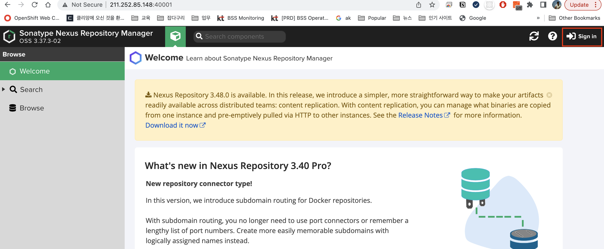 

<br/>

로그인을 하기 위한 초기 admin 패스워드를 찾아서 입력하라는 메시지가 나온다.

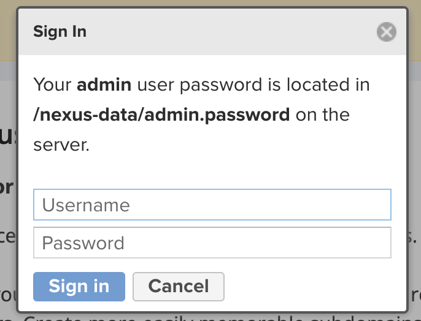 

아래 명령어를 사용하여 비밀번호를 복사를 하고 admin/비밀번호를 입력하여 로그인한다.  

```bash  
root@newedu:~# docker ps
0707399abffd   sonatype/nexus3:3.37.3          "sh -c ${SONATYPE_DI…"   3 days ago     Up 3 days   0.0.0.0:40010->40010/tcp, :::40010->40010/tcp, 0.0.0.0:40001->8081/tcp, :::40001->8081/tcp         nexus
root@newedu:~# docker exec -it nexus cat /nexus-data/admin.password
abe090cf-68c4-43ba-a6ff-b58d3c82fec4
```  

<br/>

admin 비밀번호를 입력한다.  

<br/>

기본 설정 화면이 나오고 단계별로 진행한다.  

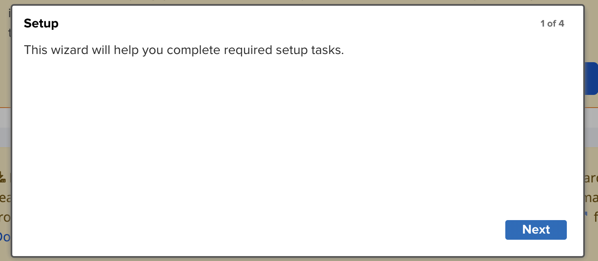 

<br/>

admin 비밀번호를 신규로 설정한다.  

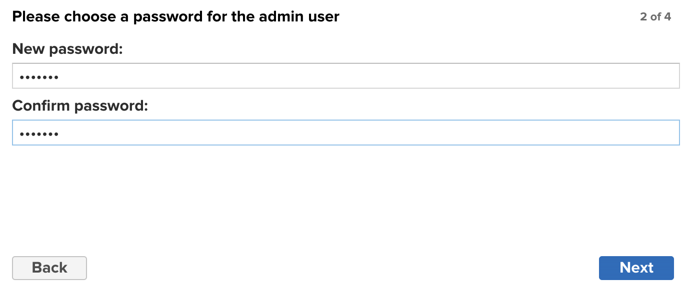 


<br/>

anonymous 접속을 disable 한다.  

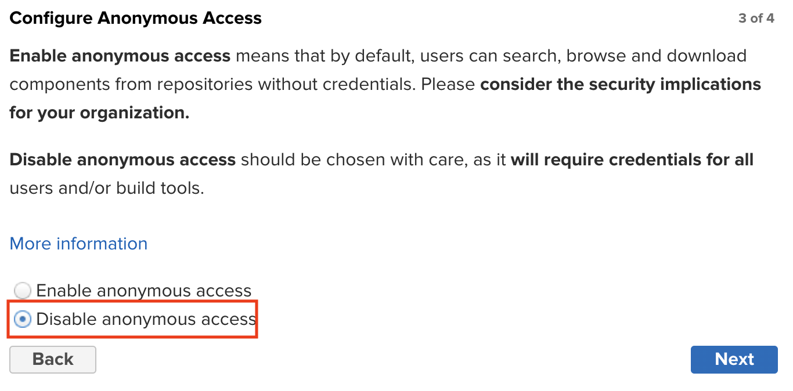 

<br/>

단계를 완료한다.  

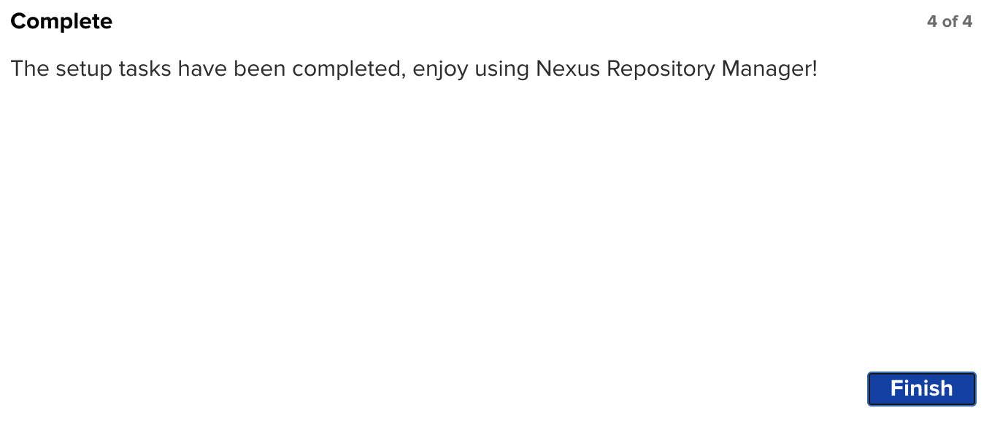 


<br/>

### Nexus 설정

<br/>


먼저 Blob Store를 생성한다. 반드시 필요 한것은 아니지만 향후 용도별로 구분하기 위하여 필요 할 수 있다.    

상단의 톱니 바퀴를 클릭한다.

<br/>

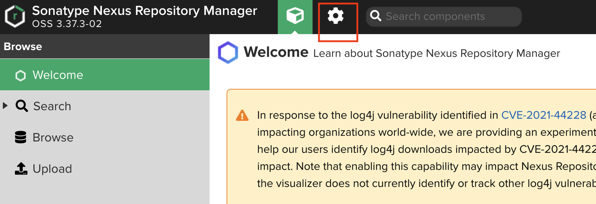 

<br/>

Blob Stores를 선택하고 Creat 버튼을 클릭한다.

<br/>

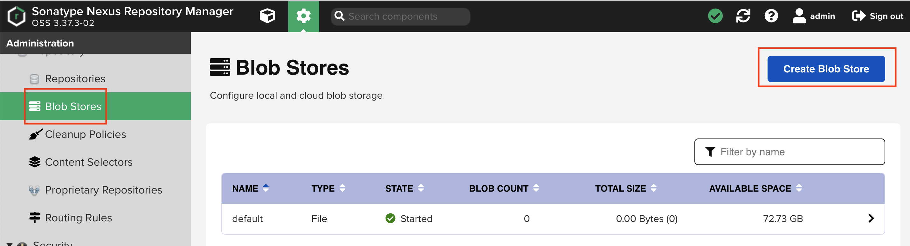 

<br/>

Type은 File로 선택하고 이름은 docker-hosted 라고 준다. 이름은 원하는 이름으로 설정해도 된다.  

<br/>

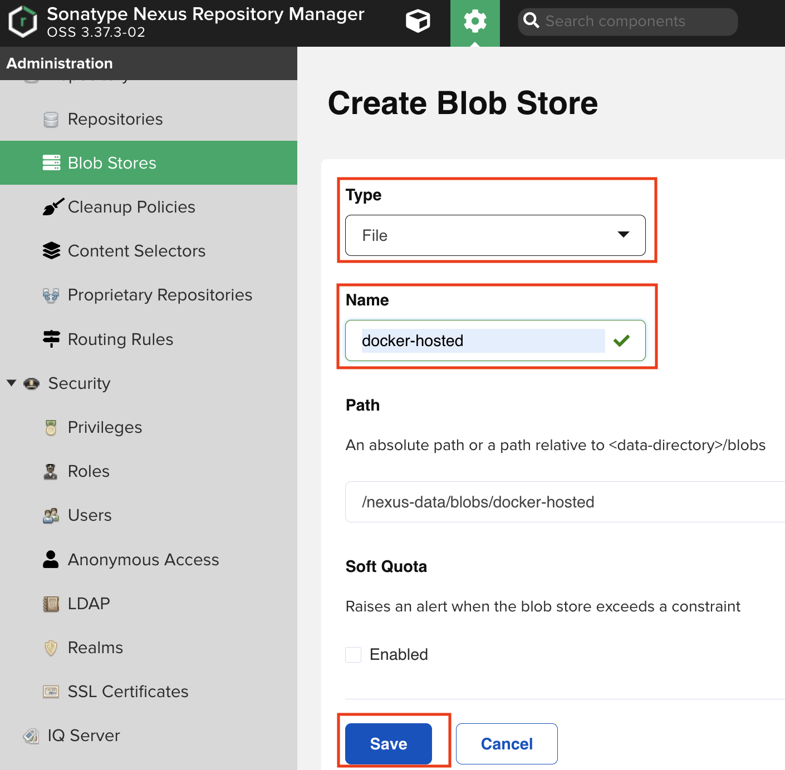 

<br/>

이제 Docker registry 를 만들기 위한 Repostory 를 생성한다. 
Repository -> Create Repository를 선택한다.  

<br/>

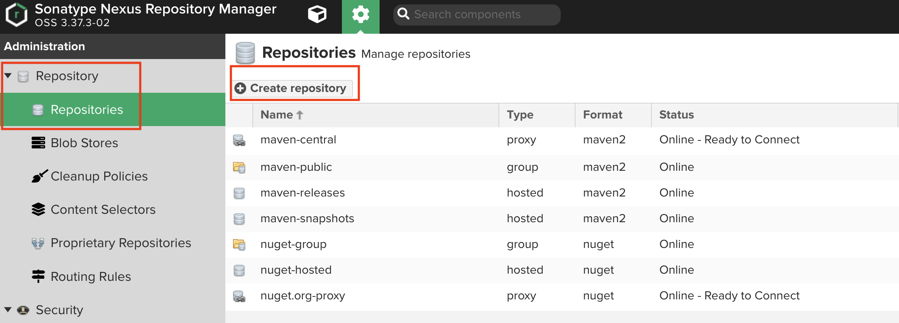 

docker (hosted) 를 선택한다. 

<br/>

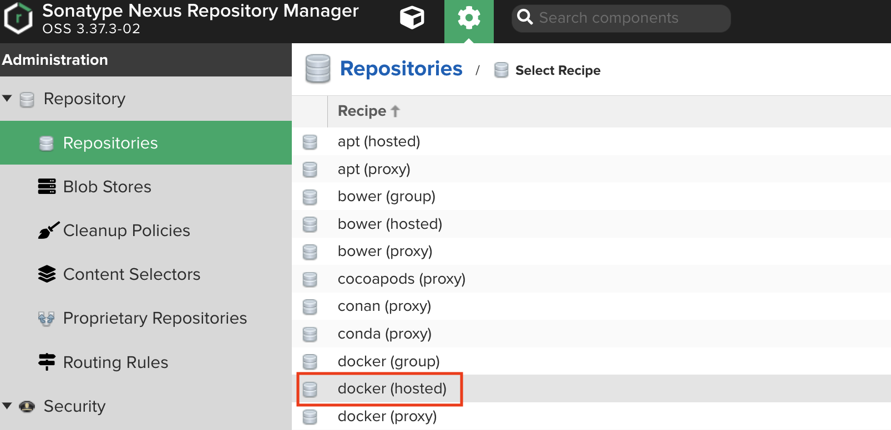 


이름을 docker-hosted 로 입력한다.     

http 포트는 컨테이너 실행시 설정한 docker registry 포트인 40010으로 설정한다.  

Allow anonymous pull 를 체크하면 pull은 누구나 가능하도록 설정하고 Enable Docker V1 API도 체크 해준다.  

<br/>

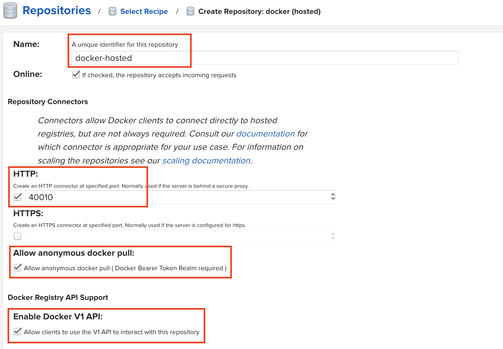 

<br/>

Blob Store는 앞에서 생성한 docker-hosted를 선택하고 저장한다.

<br/>

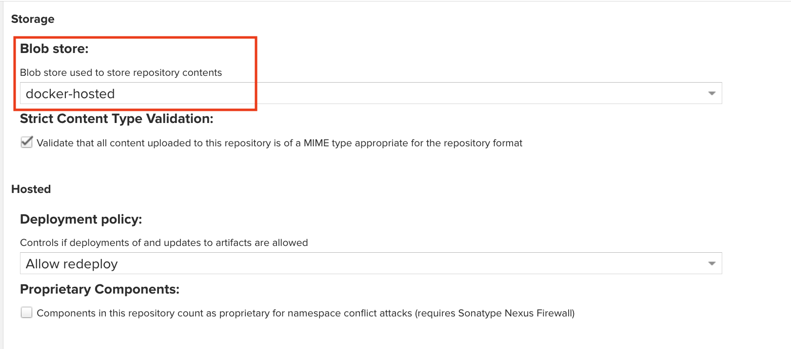 

<br/>

Realms 을 설정하여 Docker Bearer token을 활성화 한다.  

<br/>

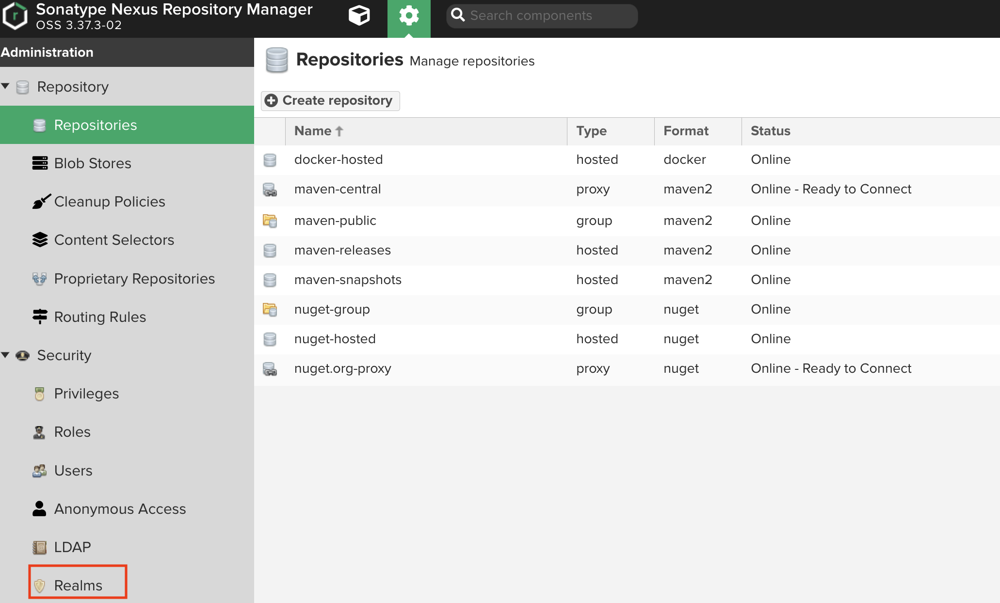 

<br/>

Realms -> Docker Bearer token 선택하여 Active로 이동시킨다.  

<br/>

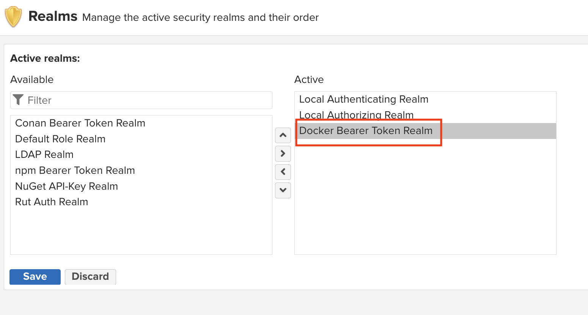 

<br/>

사용자를 신규로 생성한다.  

<br/>

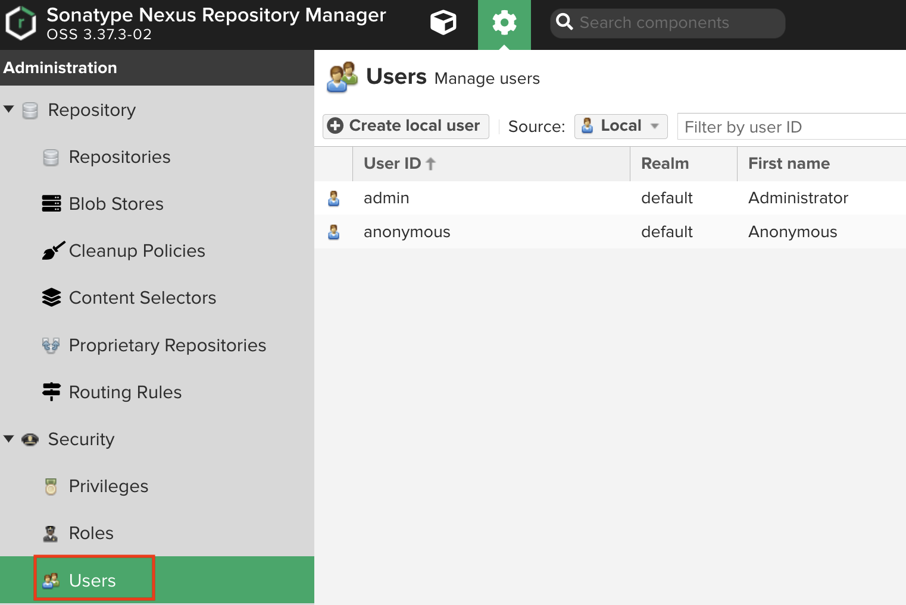 

<br/>

nx-admin을 granted로 설정한다.  

<br/>

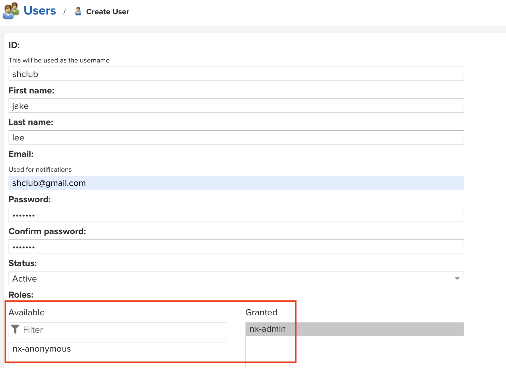 

<br/>


##  Remote 로 연결하기  ( Insecure Registry 설정 )

<br/>

### Insecure Registry 설정

<br/>

우리가 구축한 docker registry는 http로 설정이 되어 있지만 docker client에서는  https로 연결을 시도한다.  

정상적으로 remote 에서 연결 하기 위해서는 insecure registry를 설정해야 한다.

<br/>

linux인 경우 `/etc/docker/daemon.json` 화일을 vi 에디터로 열고 아래와 같이 추가한다.    
docker registry의 ip와 포트를 입력한다.  

<br/>

```bash
root@newedu:~# vi /etc/docker/daemon.json
{
  "insecure-registries": [
    "211.252.85.148:40010"
  ]
}
```  

<br/>

위의 작업을 한후 docker 를 재기동 한다.  

```bash
systemctl restart docker
```  
<br/>

docker를 재기동 하면 nexus를 다시 실행 시켜야 한다.    

먼저 기존의 컨테이너 이름인 nexus를 삭제하고 재기동한다.  

<br/>


```bash
root@newedu:/# docker rm nexus
root@newedu:/# docker run -d --name nexus -v nexus:/nexus-data -p 40001:8081 -p 40010:40010  sonatype/nexus3:3.37.3
```  

<br/>

참고로,  

윈도우나 맥 사용자는 docker desktop 에서 preferences 메뉴를 선택하여 docker engine을 수정한다.  

<br/>

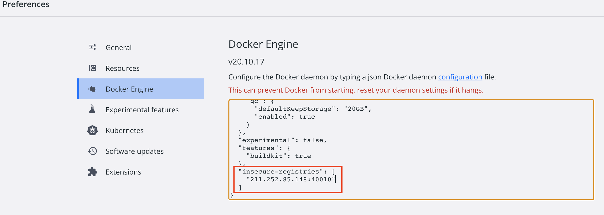 

<br/>

### 이미지 push 하기  

<br/>

먼저 도커 Tagging 을 하고 push를 해보면 unauthorized 에러가 발생한다.  

<br/>


```bash
root@newedu:~# docker tag nginx:1.14 211.252.85.148:40010/nginx:1.14
root@newedu:~# docker push 211.252.85.148:40010/nginx:1.14
The push refers to repository [211.252.85.148:40010/nginx]
82ae01d5004e: Preparing
b8f18c3b860b: Preparing
5dacd731af1b: Preparing
unauthorized: access to the requested resource is not authorized
```  
<br/>

private docker registry에 로그인을 한다.  
계정은 위에서 생성한 nexus 계정을 사용한다.  

<br/>

```bash
root@newedu:~# docker login 211.252.85.148:40010
Username: shclub
Password:
WARNING! Your password will be stored unencrypted in /root/.docker/config.json.
Configure a credential helper to remove this warning. See
https://docs.docker.com/engine/reference/commandline/login/#credentials-store

Login Succeeded
```

<br/>

이제 다시 push 한다. 

```bash
root@newedu:~# docker push 211.252.85.148:40010/nginx:1.14
The push refers to repository [211.252.85.148:40010/nginx]
82ae01d5004e: Pushed
b8f18c3b860b: Pushed
5dacd731af1b: Pushed
1.14: digest: sha256:706446e9c6667c0880d5da3f39c09a6c7d2114f5a5d6b74a2fafd24ae30d2078 size: 948
```  

<br/>

에러가 발생하지 않았으면 정상적으로 push가 된것이고 nexus에서  다시 확인해 본다.  

<br/>

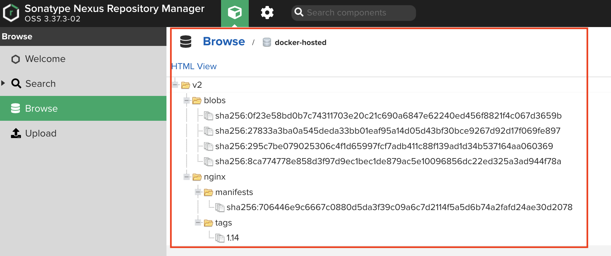


<br/>

##  과제 ( private registry 를 사용하여 Jenkins Pipeline 구성 )

<br/>

### 본인의 Nexus private registry를 사용하여 Jenkins Pipeline 구성

<br/>

순서
- credential을 private docker registry 용으로 신규로 구성 한다.  
- New Item으로 신규 pipeline을 구성한다. ( copy from 이름 활용 )
- Jenkins 화일을 신규 생성하고 docker registry 관련 값을 수정한다.
- pipeline 을 실행시키고 본인의 nexus에 도커 이미지가 저장되었는지 확인한다.  


