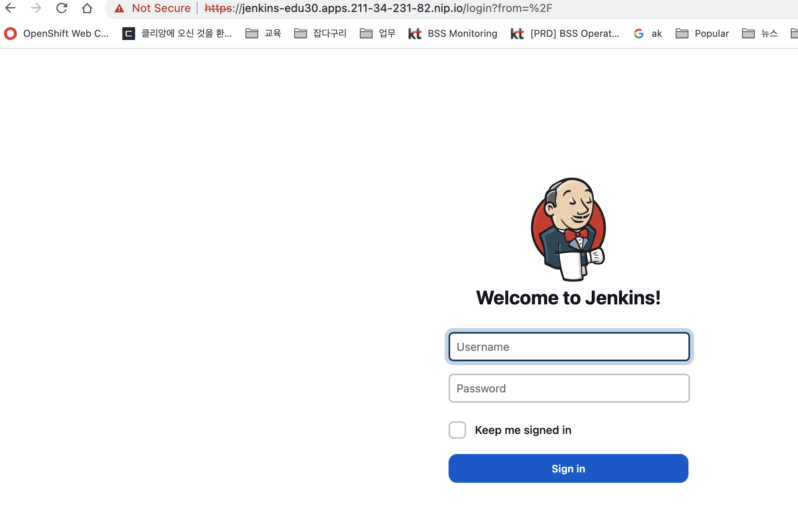
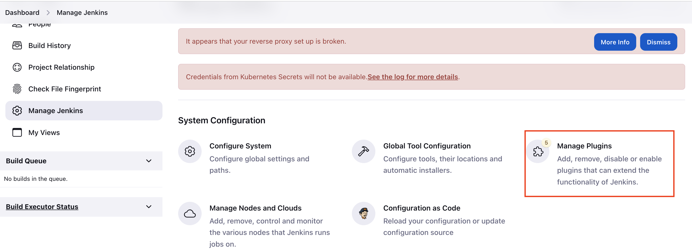
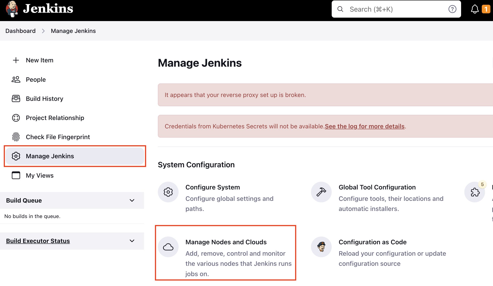
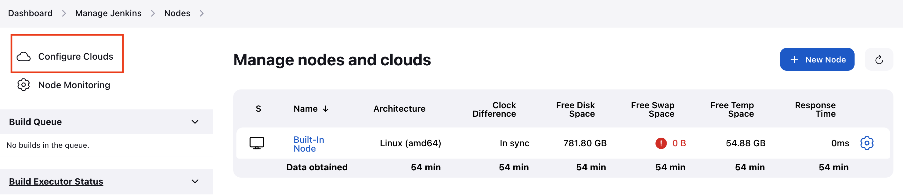
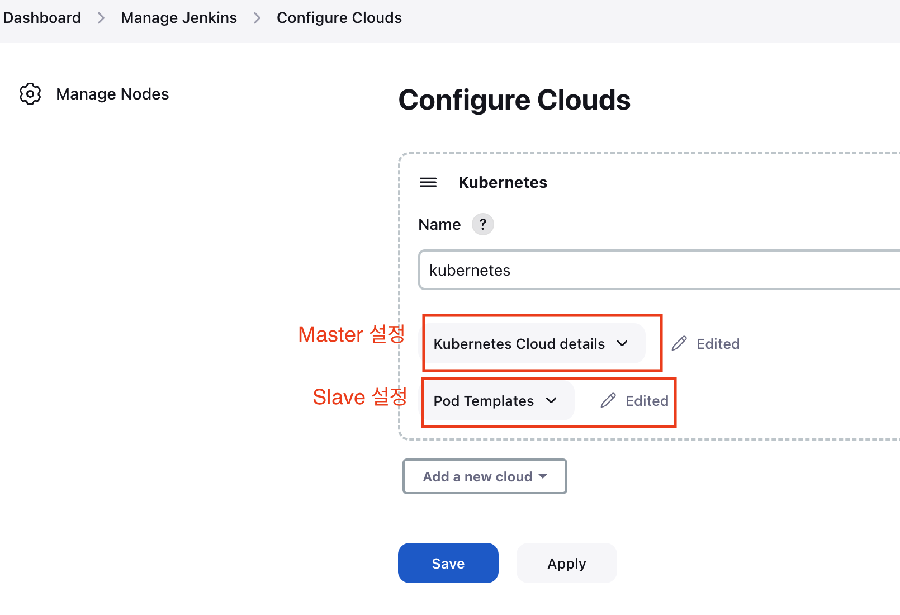
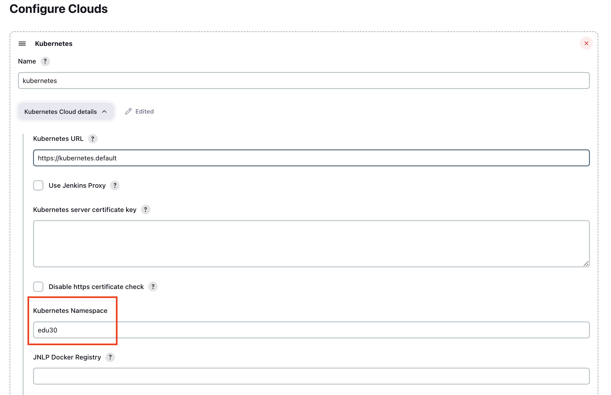
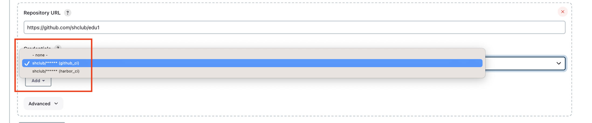
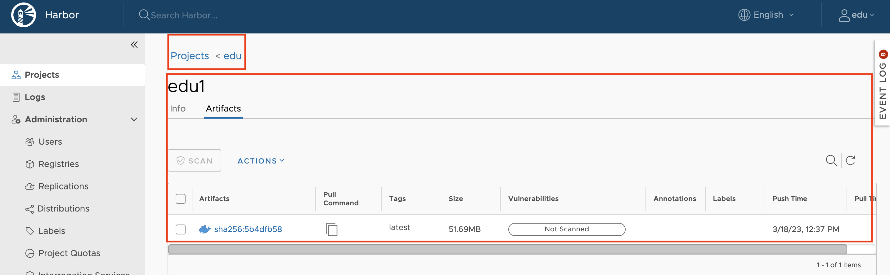

# 과제  
 
매 주 마다 과제는 아래와 같다.

1. 1주차
    -  Nexus private registry를 사용하여 Jenkins Pipeline 구성
    -  컨테이너 Mysql DB 활용
    -  Portainer 설치
    -  Harbor 구성해 보기 
2. 2주차 : CKA 문제 풀어 보기 [ 문제 ](./cka.md) 
3. 3주차 : kubernetes에 Jenkins Master/Slave 구성하기 (CI - Python )
4. 4주차 : kubernetes에 CI/CD 구성 (CI : Maven/Skaffold , CD : ArgoCD/kustomize )

<br/>

##  1주차

<br/>

### Nexus private registry를 사용하여 Jenkins Pipeline 구성

<br/>

순서
- credential을 private docker registry 용으로 신규로 구성 한다.  
- New Item으로 신규 pipeline을 구성한다. ( copy from 이름 활용 )
- Jenkins 화일을 신규 생성하고 docker registry 관련 값을 수정한다.
- pipeline 을 실행시키고 본인의 nexus에 도커 이미지가 저장되었는지 확인한다.    
- 참고 :  Jenkins_private 화일  


### 컨테이너 Mysql DB 활용 

<br/>

 docker compose로 구성한 mysql container에 접속하여 로그인 한 후 wordpress db에 customer 테이블을 생성해 본다.  
 - docker-compose.yml 화일 참고
 - table 이름은 customer 이고 필드는 customer_id , customer_name 만 필요  

<br/>

### Portainer 설치

<br/>

docker 컨테이너 GUI 관리 툴인 portainer를 설치하고 웹에서 접속하여
          모니터링한다.
  - url  참고 :  https://docs.portainer.io/v/ce-2.11/start/install/server/docker/linux
  - 웹 포트는 40005로 expose 한다 ( https 9443 포트 변경 필요 ).
  - 웹브라우저 접속은 https://(본인VM Public IP):40005  
     admin 비밀번호 신규로 생성 (8자리 이상) 한다.

<br/>

### Harbor 구성해 보기

<br/>

Harbor 설치 ( https가 힘든 사람은 http 로 구성 )
- Private Docker Registry 를 Harbor를 사용하여 구성 한다.
- Harbor 포트는 40002를 사용하며 https 연결하기 위한 인증서 설정을 한다.
- Harbor 에 edu 프로젝트를 생성하고 신규 계정을 생성하여 members에 추가한다.
- nginx 이미지를 본인의 Private Docker Registry에 Push 한다.
- Harbor에서 확인한다.
- clair 를 사용하여 도커 취약점을 분석한다.  

<br/>

샘플 : https://211.252.85.148:40002/  
계정 : admin/New1234!

<br/> 


##  2주차

<br/>

### CKA 예상 문제 중에 풀어볼 문제.


<br/>

- Master Node에 ssh 로 접속하여 kubectl 명령어 사용 ( worker node에서는 안됨 )
- Master Node 에서 본인의 폴더에 들어가서 작업을 한다. ( edu1 ~ edu 21 )
- Namespace는 직접 만들어서 사용한다.
  - 예 ) kubectl create namespace edu1
- 모든 작업은 본인의 namespace 에서 진행을 한다. ( 반드시 namespace 명시 :  `-n < 본인 namespace 명 >`  )
  - 예) kubectl apply -f test.yaml -n edu1  
  - 예) kubectl get po -n edu1

<br/>

필수 문제
- 2번 :
- 3번 : static pod는 본인의 순번을 앞에 붙인다 ( 예, edu1_web )
- 4번 :
- 7번 :
- 9번 :
- 10번 :
- 11번 :


##  3주차

<br/>

### kubernetes에 Jenkins Master/Slave 구성하기


<br/>

로그인 한 후에 jenkins 폴더를 생성한다.  

<br/>

```bash
root@newedu:~# mkdir -p jenkins
root@newedu:~# cd jenkins
```

<br/>

#### 계정 생성과 RBAC 생성

<br/>

jenkins admin 계정의 secret를 생성하기 위해 계정과 비밀번호를 base64로 인코딩 한다.

<br/>

계정과 비밀번호는 admin/New1234! 로 설정

TODO 

<br/>

secret를 만들기 위해 yaml 화일을 생성한다.        

TODO  

secret은 2개의 필드가 필요하며 아래 helm jenins_values.yaml 화일의 
2개의 필드와 이름이 같아야 한다.  

<br/>

```bash
 50   admin:
 51     existingSecret: "jenkins-admin-secret" #
 52     userKey: jenkins-admin-user
 53     passwordKey: jenkins-admin-password
```  


<br/>


data 부분에 base64 인코딩 된 값을 넣어준다.

`jenkins-admin-secret` 이름으로 secret 생성.

<br/>

TODO

<br/>

secret를 생성하고 확인한다.

<br/>

```bash
root@newedu:~/jenkins# kubectl apply -f jenkins-edu-admin-secret.yaml
secret/jenkins-admin-secret created
root@newedu:~/jenkins# kubectl get secret
NAME                                 TYPE                                  DATA   AGE
jenkins-admin-secret                 Opaque                                2      7s
my-service-account-dockercfg-4j5n7   kubernetes.io/dockercfg               1      169d
my-service-account-token-d67wk       kubernetes.io/service-account-token   4      169d
my-service-account-token-wxttf       kubernetes.io/service-account-token   4      169d
super-secret                         Opaque                                1      169d
```

<br/>

`jenkins-admin` service account 를 생성 하고  ClusterRole 과 ClusterRolebinding 을 생성한다.  

TODO : sa 생성

<br/>


```bash
root@newedu:~/jenkins# vi jenkins_rbac.yaml
```

<br/>
jenkins-admin 권한은 최소화 한다.

<br/>

```bash
apiVersion: rbac.authorization.k8s.io/v1
kind: ClusterRole
metadata:
  name: jenkins-admin
rules:
- apiGroups: [""]
  resources: ["pods"]
  verbs: ["create","delete","get","list","patch","update","watch"]
- apiGroups: [""]
  resources: ["pods/exec"]
  verbs: ["create","delete","get","list","patch","update","watch"]
- apiGroups: [""]
  resources: ["pods/log"]
  verbs: ["get","list","watch"]
- apiGroups: [""]
  resources: ["secrets"]
  verbs: ["get"]
- apiGroups: [""]
  resources: ["events"]
  verbs: ["get", "watch"]
---
apiVersion: rbac.authorization.k8s.io/v1
kind: ClusterRoleBinding
metadata:
  name: jenkins-admin
roleRef:
  apiGroup: rbac.authorization.k8s.io
  kind: Role
  name: jenkins-admin
subjects:
- kind: ServiceAccount
  name: jenkins-admin
```

<br/>

본인의 namespace 에 적용한다.

<br/>

```bash
root@newedu:~/jenkins# kubectl apply -f jenkins_rbac.yaml
serviceaccount/jenkins-admin created
role.rbac.authorization.k8s.io/jenkins-admin created
rolebinding.rbac.authorization.k8s.io/jenkins-admin created
```  

<br/>

생성된 resource 들을 확인한다.  

<br/>

```bash
root@newedu:~/jenkins# kubectl get sa
NAME                 SECRETS   AGE
builder              2         247d
default              2         247d
deployer             2         247d
edu                  2         7d20h
jenkins-admin        2         10s
my-service-account   2         169d
root@newedu:~/jenkins# kubectl get role
NAME            CREATED AT
developer       2022-09-27T14:16:45Z
jenkins-admin   2023-03-16T02:03:11Z
pod-role        2022-09-27T14:04:40Z
root@newedu:~/jenkins# kubectl get rolebindings
NAME                              ROLE                                          AGE
admin                             ClusterRole/admin                             247d
developer-binding-myuser          Role/developer                                169d
edu30-admin                       ClusterRole/admin                             247d
jenkins-admin                     Role/jenkins-admin                            23s
pod-rolebinding                   Role/pod-role                                 169d
pod-rolebinding2                  Role/pod-role                                 7d19h
system:deployers                  ClusterRole/system:deployer                   247d
system:image-builders             ClusterRole/system:image-builder              247d
system:image-pullers              ClusterRole/system:image-puller               247d
system:openshift:scc:privileged   ClusterRole/system:openshift:scc:privileged   182d
```  

<br/>

jenkins-admin 으로 OKD에 접속하기 위해 anyuid, privileged 권한을 부여한다.    

privileged 권한은 podman 에서 cri-o 런타임을 연결하기 위해 필요하다.  

<br/>

```bash
root@newedu:~/jenkins# oc adm policy add-scc-to-user anyuid -z jenkins-admin 
clusterrole.rbac.authorization.k8s.io/system:openshift:scc:anyuid added: "jenkins-admin"
root@newedu:~/jenkins# oc adm policy add-scc-to-user privileged -z jenkins-admin
clusterrole.rbac.authorization.k8s.io/system:openshift:scc:privileged added: "jenkins-admin"
```  

<br/>

#### Storage 설정

<br/>


Jenkins 가 사용하는 stroage를 위해 pv / pvc 를 생성해야 하며
사전에 NFS 에 접속하여 폴더를 생성한다.   

폴더는 아래와 같이 사전 생성 되어 있음.

<br/>

```bash
[root@edu jenkins]# mkdir -p edu
[root@edu jenkins]# mkdir -p edu1
[root@edu jenkins]# ls
edu  edu1  edu10  edu11  edu12  edu13  edu14  edu15  edu16  edu17  edu18  edu19  edu2  edu20  edu21  edu3  edu4  edu5  edu6  edu7  edu8  edu9
```

<br/>

Jenkins slave 용 폴더도 생성한다.

```bash
[root@edu jenkins]# mkdir -p edu
[root@edu jenkins]# mkdir -p edu1_slave
...
```

<br/>

jenkins master / slave 용 해당 폴더의 권한을 설정한다.

<br/>

```bash
[root@edu jenkins]# chown -R nfsnobody:nfsnobody edu
[root@edu jenkins]# chmod 777 edu
[root@edu jenkins]# chown -R nfsnobody:nfsnobody edu_slave
[root@edu jenkins]# chmod 777 edu_slave
```  

<br/>

Master용 PV 를 생성한다. 사이즈는 5G로 설정한다.

<br/>

이름은 아래와 같이 생성한다.  

jenkins_pv.yaml  

예)  edu1 : jenkins-edu1-pv  
     edu2 : jenkins-edu2-pv

<br/>

PV를 생성하고 Status를 확인해보면 Available 로 되어 있는 것을 알 수 있습니다.  

<br/>

```bash
root@newedu:~/jenkins# kubectl apply -f  jenkins_pv.yaml
persistentvolume/jenkins-edu-pv created
root@newedu:~/jenkins# kubectl get pv jenkins-edu-pv
NAME             CAPACITY   ACCESS MODES   RECLAIM POLICY   STATUS      CLAIM   STORAGECLASS   REASON   AGE
jenkins-edu-pv   5Gi        RWX            Retain           Available                                   10s
```

<br/>

Master용 pvc 를 생성합니다. pvc 이름을 기억합니다.

<br/>

예)  edu1 : jenkins-edu1-pvc  
     edu2 : jenkins-edu2-pvc

<br/>


Slave 용 PV 를 생성한다. 사이즈는 5G로 설정한다.

<br/>

```bash  
root@newedu:~/jenkins#  vi jenkins_slave_pv.yaml
```  

jenkins_slave_pv.yaml  

예)  edu1 : jenkins-edu1-slave-pv  
     edu2 : jenkins-edu2-slave-pv


<br/>

PV를 생성하고 Status를 확인해보면 Available 로 되어 있는 것을 알 수 있습니다.  

<br/>

```bash
root@newedu:~/jenkins# kubectl apply -f  jenkins_slave_pv.yaml
persistentvolume/jenkins-edu-slave-pv created
root@newedu:~/jenkins# kubectl get pv jenkins-edu-slave-pv
NAME                   CAPACITY   ACCESS MODES   RECLAIM POLICY   STATUS   CLAIM                         STORAGECLASS   REASON   AGE
jenkins-edu-slave-pv   5Gi        RWX            Retain           Bound    edu30/jenkins-edu-slave-pvc                           100s
```

<br/>

Slave 용 pvc 를 생성합니다. pvc 이름을 기억합니다.

<br/>

```bash
root@newedu:~/jenkins# vi jenkins_slave_pvc.yaml
```


예)  edu1 : jenkins-edu1-slave-pvc  
     edu2 : jenkins-edu2-slave-pvc


<br/>

PVC를 생성할 때는 namespace ( 본인의 namespace ) 를 명시해야 합니다.  
PVC 생성을 확인 해보고 다시 PV를 확인해 보면 Status가 Bound 로 되어 있는 것을 알 수 있습니다.  이제 PV 와 PVC가 연결이 되었습니다.

<br/>

```bash
root@newedu:~/jenkins# kubectl apply -f jenkins_slave_pvc.yaml
persistentvolumeclaim/jenkins-edu-slave-pvc created
root@newedu:~/jenkins# kubectl get pvc
NAME                    STATUS   VOLUME                 CAPACITY   ACCESS MODES   STORAGECLASS   AGE
app-volume              Bound    app-config             1Gi        RWX            az-c           169d
jenkins-edu-pvc         Bound    jenkins-edu-pv         5Gi        RWX                           136m
jenkins-edu-slave-pvc   Bound    jenkins-edu-slave-pv   5Gi        RWX                           3m27s
root@newedu:~/jenkins# kubectl get pv jenkins-edu-slave-pv
NAME                   CAPACITY   ACCESS MODES   RECLAIM POLICY   STATUS   CLAIM                         STORAGECLASS   REASON   AGE
jenkins-edu-slave-pv   5Gi        RWX            Retain           Bound    edu30/jenkins-edu-slave-pvc                           4m
```

<br/>

#### Helm  Jenkins  설정

<br/>

Jenkins 는 Helm Chart 를 이용하여 설치를 합니다.  

<br/>

현재 로컬의 helm repository 를 확인한다.   

<br/>

```bash
root@newedu:~/jenkins# helm repo list
NAME                           	URL
bitnami                        	https://charts.bitnami.com/bitnami
nfs-subdir-external-provisioner	https://kubernetes-sigs.github.io/nfs-subdir-external-provisioner/
```  

<br/>

jenkins helm repository를  아래와 같이 추가 한다.

<br/>

```bash
root@newedu:~/jenkins# helm repo add jenkins https://charts.jenkins.io --insecure-skip-tls-verify
"jenkins" has been added to your repositories
```

<br/>

helm repository를 update 한다.  

<br/>

```bash
root@newedu:~/jenkins# helm repo update
Hang tight while we grab the latest from your chart repositories...
...Successfully got an update from the "nfs-subdir-external-provisioner" chart repository
...Successfully got an update from the "jenkins" chart repository
...Successfully got an update from the "bitnami" chart repository
Update Complete. ⎈Happy Helming!⎈
```  

<br/>

jenkins helm reppository 에서 helm chart를 검색을 하고 jenkins chart를 선택합니다.  

<br/>

```bash
root@newedu:~/jenkins# helm search repo jenkins
NAME           	CHART VERSION	APP VERSION	DESCRIPTION
bitnami/jenkins	12.0.1       	2.387.1    	Jenkins is an open source Continuous Integratio...
jenkins/jenkins	4.3.8        	2.387.1    	Jenkins - Build great things at any scale! The ...
```

<br/>

jenkins/jenkins 차트에서 차트의 변수 값을 변경하기 위해 jenkins_values.yaml 화일을 추출한다.

<br/>


TODO

<br/>

vi 데이터에서 생성된 jenkins_values.yaml을 연다.  

<br/>

```bash
root@newedu:~# vi jenkins_values.yaml
```  

라인을 보기 위해 ESC 를 누른 후 `:set nu` 를 입력하면 왼쪽에 라인이 보인다.  

아래 라인을 찾아 값을 변경한다.  51번 라인에 앞에서 생성한 secret을 넣는다.   

pvc는 본인의 pvc 를 설정한다.

<br/>

```bash
 50   admin:
 51     existingSecret: "jenkins-admin-secret" #
 52     userKey: jenkins-admin-user
 53     passwordKey: jenkins-admin-password
```  

<br/>

```bash
508   # Openshift route
509   route:
510     enabled: true  # true 로 변경
511     labels: {}
512     annotations: {}
...
617 agent:
618   enabled: true
619   defaultsProviderTemplate: ""
620   # URL for connecting to the Jenkins contoller
621   jenkinsUrl:
622   # connect to the specified host and port, instead of connecting directly to the Jenkins controller
623   jenkinsTunnel:
624   kubernetesConnectTimeout: 5
625   kubernetesReadTimeout: 15
626   maxRequestsPerHostStr: "32"
627   namespace:
628   image: "jenkins/jnlp-slave" #"jenkins/inbound-agent"
629   tag: "latest-jdk11"
...
662   volumes: # []
663   # - type: ConfigMap
664   #   configMapName: myconfigmap
665   #   mountPath: /var/myapp/myconfigmap
666   # - type: EmptyDir
667   #   mountPath: /var/myapp/myemptydir
668   #   memory: false
669   # - type: HostPath
670   #   hostPath: /var/lib/containers
671   #   mountPath: /var/myapp/myhostpath
672   # - type: Nfs
673   #   mountPath: /var/myapp/mynfs
674   #   readOnly: false
675   #   serverAddress: "192.0.2.0"
676   #   serverPath: /var/lib/containers
677    - type: PVC
678      claimName: jenkins-edu-slave-pvc
679      mountPath: /var/jenkins_home
680      readOnly: false
...
691   workspaceVolume: # {}
692   ## DynamicPVC example
693   # type: DynamicPVC
694   # configMapName: myconfigmap
695   ## EmptyDir example
696   # type: EmptyDir
697   # memory: false
698   ## HostPath example
699   # type: HostPath
700   # hostPath: /var/lib/containers
701   ## NFS example
702   # type: Nfs
703   # readOnly: false
704   # serverAddress: "192.0.2.0"
705   # serverPath: /var/lib/containers
706   ## PVC example
707    type: PVC
708    claimName: jenkins-edu-slave-pvc
709    readOnly: false
710   #
710   #
...

822 persistence:
823   enabled: true
824   ## A manually managed Persistent Volume and Claim
825   ## Requires persistence.enabled: true
826   ## If defined, PVC must be created manually before volume will be bound
827   existingClaim: "jenkins-edu-pvc" #
828   ## jenkins data Persistent Volume Storage Class
829   ## If defined, storageClassName: <storageClass>
830   ## If set to "-", storageClassName: "", which disables dynamic provisioning
831   ## If undefined (the default) or set to null, no storageClassName spec is
832   ##   set, choosing the default provisioner.  (gp2 on AWS, standard on
833   ##   GKE, AWS & OpenStack)
834   ##
835   storageClass:
836   annotations: {}
837   labels: {}
838   accessMode: "ReadWriteOnce"
839   size: "5Gi"  # "8Gi"  
...

870 serviceAccount:
871   create: false #  이미 생성 했기 때문에 false 로 변경
872   # The name of the service account is autogenerated by default
873   name: "jenkins-admin" #
874   annotations: {}
875   extraLabels: {}
876   imagePullSecretName:

```  

#### Helm 으로 Jenkins 설치

<br/>

jenkins_values.yaml 를 사용하여 설치 한다.

<br/>


TODO

<br/>

설치가 완료되면 pod를 조회하여 jenkins-0 pod가 있는지 확인한다.

<br/>

```bash
root@newedu:~/jenkins# kubectl get po
NAME                                        READY   STATUS    RESTARTS   AGE
jenkins-0                                   2/2     Running   0          18h
nfs-test-589c488d6f-8lk5p                   1/1     Running   0          40h
``` 

<br/>

#### Jenkins 설정

<br/>

웹 브라우저 에서 본인의 jenkins 로 접속한다.   
route 정보를 모르면 아래 명령어로 조회한다.

<br/>

```bash
root@newedu:~/jenkins# kubectl get route
NAME      HOST/PORT                                 PATH   SERVICES   PORT   TERMINATION     WILDCARD
jenkins   jenkins-edu30.apps.211-34-231-82.nip.io          jenkins    http   edge/Redirect   None
```  

<br/>

https://jenkins-edu30.apps.211-34-231-82.nip.io/


<br/>

아래 처럼 로그인 화면이 나오면 admin 계정으로 로그인한다.

<br/>

 

<br/>

Manage Jenkins 메뉴를 클릭한다.

<br/>

 

Manage Plugins 메뉴를 클릭한다.

<br/>

 

<br/>

Plugin은 3 가지를 설치한다.  
- git parameter
- pipeline stage view
- docker pipeline    

TODO : 플러그인 설치

<br/>

plugin 설정을 완료 하면 Manage jenkins -> Manage Nodes and Clouds 메뉴로 이동하여 Jenkins 설정을 한다.  

<br/>

 

<br/>

Configure Clouds로 이동한다.  

<br/>

   

<br/>

Configure Clouds에 가면  kubernetes Cloud Details 가 Jenkins Master 설정이고 Pod Template 에 Slave 설정을 하면 된다.  

<br/>

 


<br/>

kubernetes Cloud Details 를 확장하여 자세히 보면 Jenkins Master POD가 있는 namespace 를 확인 할 수 있다.  

<br/>

 

기본값으로 설정된 값을 유지한다.

<br/>

POD Labels의 key 값만 변경한다. 안해도 상관 없음  


<br/>

Pod Template 을 확장하여 Slave 설정을 시작한다.    
우리는 OKD 에 Jenkins를 설치를  하였고 OKD는 docker runtime 대신 CRI-O runtime을 사용하기 때문에 podman 으로 docker 를 대신한다.   

<br/>

podman-agent라는 이름으로 설정을 하고 Pod template details 를 클릭한다.   

<br/>


Pod Template Label은  podman-agent 로 설정한다.    

<br/>

하나의 POD에 2개의 컨테이너를 설정한다.
- JNLP 컨테이너 : jenkins slave 를 위한 컨테이너
- Podman 컨테이너 : Podman 프로그램이 설치된 컨테이너  
   - podman 컨테이너의 /etc/containers와 /var/lib/containers를 hostpath로 연결해 주어야 한다.
   - podman에서 worker node의 cri-o 런타임 엔진을 사용  
   
<br/>

먼저 jnlp 컨테이너 값을 설정한다.  
- docker image 를 변경한다 : jenkins/jnlp-slave:latest-jdk11  
- command to run 을 기존 sleep 값을 지운다.

<br/>


podman 컨테이너를 설정한다.    
- 이름을 설정한다 : podman
- docker image 를 설정한다 : mattermost/podman:1.8.0  
- Advanced 메뉴를 클릭하고 Run in privileged mode를 체크한다. (hostpath)  

<br/>

Add volume 버튼을 클릭하고 slave 용 pvc와 podman용 hostpath를 설정한다.   

slave용 pvc는 이미 설정이되어 있기 때문에 hostpath 만 설정해도 된다.  

<br/>


아래로 이동하여 service account를 `jenkins-admin` 으로 변경한다.  

workspace volume 도 helm 에서 사전에 설정 했기 때문에 확인만 하고 save 버튼을 눌러 저장한다.  

<br/>


#### Jenkins Pipeline 생성

<br/>

대쉬보드로 이동하여 신규 pipeline을 구성 한다.   

New Item 버튼을 클릭한다.

<br/>

Item 이름을 설정하고 pipeline 을 선택한 후 ok 버튼을 클릭한다.

<br/>

Git Parameter 를 설정 한다. 
Git Parameter 가 안보이는 수강생은 plugins 에서 git parameter를 설치해야 한다.  

<br/>


git Repostory는 본인의 git 주소를 입력하고 script path를 입력한다.    

강사 edu1 (https://github.com/shclub/edu1) repository의 Jenkinsfile_okd 화일을 참고하여 신규 생성한다.  

<br/>


credential은 Add 버튼을 클릭하여 github_ci 와 harbor_ci 라는 이름 으로 생성한다.  

harbor 가 구성이 안된 사람은  id는 `edu` , 비밀번호는 `New1234!` 로 구성하여 생성한다.  

<br/>

 

<br/>

github의 Jenkinsfile_okd 는 본인의 환경에 맞게 변경한다.    
- def docker_registry = "https://211.252.85.148:40002"  
  - 예) edu1 : https://211.43.12.162:40002"
  - 예) 본인 Harbor 가 없으면 수정 하지 말것 
- def imageName = "211.252.85.148:40002/edu/edu1"
  - 예) edu1 : 211.43.12.162:40002/<본인프로젝트>/edu1
  - 예) 본인 Harbor 가 없으면서 순번이 2번인 경우 : 211.252.85.148:40002/edu2/edu1
- podTemplate의 namespace는 본인의 namespace 로 반드시 변경
- persistentVolumeClaim 의 claim은 본인의 slave claim으로 변경
  - 예) edu1 : jenkins-edu1-slave-pvc
- git url은 본인의 github repository 로 변경
- harbor credential은 다른 이름으로 생성했으면 그것에 맞추어 변경

<br/>


대쉬보드로 돌아와서 본인의 파이프 라인 클릭

<br/>

<br/>

Build with parameters 로 실행

<br/>

<br/>

성공적으로 진행이 된 것을 확인한다.  

<br/>

<br/>

Harbor로 이동하여 이미지가 정상적으로 Push 되었는지 확인한다.      

강사의 Harbor : https://211.252.85.148:40002/ 
- edu 계정으로 로그인
- 본인의 project로 이동하여 edu1 도커이미지 확인  

<br/>

 

<br/>

강사의 Jenkjns : https://jenkins-edu30.apps.211-34-231-82.nip.io/   
- 계정 : admin
  
